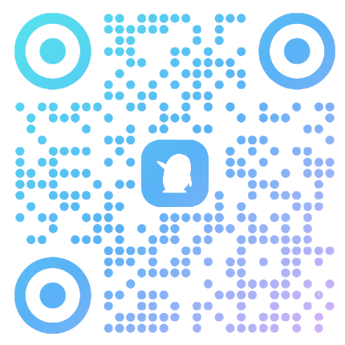

<!-- markdownlint-disable first-line-h1 -->
<!-- markdownlint-disable html -->
<!-- markdownlint-disable no-duplicate-header -->

<b>⏰ 离2026年推免系统填报志愿（9.22）还有  天 </b>

<b style="font-size: 1.2em; color: #026eea;">🌐 保研通知网：<a href="https://www.baoyantongzhi.com" target="_blank" style="color: #026eea;">https://www.baoyantongzhi.com</a></b> 
最实用、最全面、最活跃的保研信息同步服务平台

# 2026年度保研夏令营通知合集

本项目收集整理2026年度各高校保研夏令营通知信息，旨在为准备保研的同学提供及时、准确的信息参考，主要涵盖理工、经管、文法和医农。

信息实时更新，全网最快最全

## 🔍 导航
### 🏫 按学校导航

📚 [**<u>全部</u>**](./README.md) | 🔬 [**<u>理工类</u>**](./README-理工类.md) | 💰 [**<u>经管类</u>**](./README-经管类.md) | 📝 [**<u>文法类</u>**](./README-文法类.md) | 🏥 [**<u>医农类</u>**](./README-医农类.md)

### 📅 按截止日期导航

📚 [**<u>全部</u>**](./README-截止日期.md) | 🔬 [**<u>理工类</u>**](./README-理工类-截止日期.md) | 💰 [**<u>经管类</u>**](./README-经管类-截止日期.md) | 📝 [**<u>文法类</u>**](./README-文法类-截止日期.md) | 🏥 [**<u>医农类</u>**](./README-医农类-截止日期.md)

## 📢 通知清单

<h3>清华大学</h3>

| 截止时间 | 通知 |
|:------------:|:---------|
| 暂无 | [2026年清华大学环境学院国际暑期学校招募开启](https://mp.weixin.qq.com/s/MCT2PPpeZvc1-ny8hGQjkg) |
| 暂无 | [2026年清华大学深圳国际研究生院数据与信息研究院智慧物流与工业智能专业硕士项目启动招生](https://mp.weixin.qq.com/s/OzpLuDyOufFaKfwlOe-EpA) |
| 暂无 | [2026年清华大学智能产业研究院2026夏令营开始报名](https://mp.weixin.qq.com/s/O_M_JCzFaPUCHV4w0O3lLQ) |
| 2026-06-20 | [2026年清华大学生物医学交叉研究院（北京生命科学研究所）“暑期科研体验营” 报名通知](https://mp.weixin.qq.com/s/KcR1N1-_BB1TAVNFm8O_4Q) |
| 2026-06-20 | [2026年清华大学力学与工程交叉研究院 2026年暑期体验营报名通知](https://www.mechanox.tsinghua.edu.cn/cn/2026/0518/c960a7602/page.htm) |
| 2026-06-15 | [2026年清华大学航天航空学院神经调控国家工程研究中心暑期实习](https://mp.weixin.qq.com/s/0gL08oY9xNMTZF98aFYkDw) |
| 2026-06-15 | [2026年清华大学精密仪器系“精仪之光，紫荆花开”优秀大学生暑期学术交流会报名通知](https://mp.weixin.qq.com/s/dCFMg_jB_uAUa3qHFb66Kg) |
| 2026-06-15 | [2026年清华大学万科公共卫生与健康学院开放日报名通知](https://mp.weixin.qq.com/s/eyUkciRC0gBOazqTL7xdNw) |
| 2026-06-14 | [2026年清华大学电子工程系微波与天线研究所开放日报名通知](https://www.ee.tsinghua.edu.cn/info/1078/5235.htm) |
| 2026-06-10 | [2026年清华大学电子工程系信息光电子研究所2026年信息光电子开放日活动报名通知](https://www.ee.tsinghua.edu.cn/info/1078/5229.htm) |
| ~~2026-06-09~~ | [2026年清华大学生命科学联合中心2026年生命科学、基础医学与药学大学生学术交流周”通知](https://mp.weixin.qq.com/s/gEDhVcIMCwhThuUK_nIqCg) |
| ~~2026-06-09~~ | [2026年清华大学生命科学学院2026年生命科学、基础医学与药学大学生学术交流周”通知](https://mp.weixin.qq.com/s/2rABVNmHw9kAT6ej0avykA?scene=1&click_id=20) |
| ~~2026-06-09~~ | [2026年清华大学药学院2026年优秀大学生学术交流会通知](https://www.sps.tsinghua.edu.cn/info/1075/2674.htm) |
| ~~2026-05-31~~ | [2026年清华大学物理系“清物百年”本科生科研开放日活动通知](https://mp.weixin.qq.com/s/642k-Q1z3hYetXcIcWgtqQ) |
| ~~2026-05-31~~ | [2026年清华大学建筑学院建筑环境与能源应用工程专业开放日活动](https://mp.weixin.qq.com/s/T4bMmymzp1JKcgk4ifPBZw) |
| ~~2026-05-28~~ | [2026年清华大学工业工程系2026年全国大学生“工业与系统工程体验营”报名通知](https://www.ie.tsinghua.edu.cn/info/1071/4265.htm) |
| ~~2026-05-26~~ | [2026年清华大学航空发动机研究院2026年“航发新星”论坛](https://mp.weixin.qq.com/s/rgcESyHMMuFLPQsKEjZ3Bw) |
| ~~2026-05-20~~ | [2026年清华大学苏世民书院2027级招生简章](https://mp.weixin.qq.com/s/zyP58-SAW5AYIqsV23CTow) |
| ~~2026-05-07~~ | [2026年清华大学交叉信息研究院学术交流开放日](https://admission.iiis.tsinghua.edu.cn/) |
| ~~2026-04-30~~ | [2026年清华大学人工智能学院大学生学术交流日](https://nan) |
| ~~2026-04-21~~ | [2026年清华大学统计与数据科学系2026学术开放日](https://mp.weixin.qq.com/s/-Z8OHTeC1xv-Gyd9m8LM8Q) |

<h3>北京大学</h3>

| 截止时间 | 通知 |
|:------------:|:---------|
| 暂无 | [2026年北京大学环境科学与工程学院能源环境经济与政策研究室（LEEEP）课题组大学生夏令营](https://mp.weixin.qq.com/s/49l5glQrbG-K9wNKeIssfg) |
| 暂无 | [2026年北京大学深圳研究生院“2026年全国优秀大学生夏令营”报名通知](https://mp.weixin.qq.com/s/QGcY-DIYjWPMrkUMzzXAqg?scene=1&click_id=2003482067) |
| 2026-07-01 | [2026年北京大学科学智能学院关于举办“2026年全国优秀大学生夏令营”的通知](https://ai4s.pkusz.edu.cn/info/1153/1385.htm) |
| 2026-06-25 | [2026年北京大学信息工程学院“汇智凝芯“2026年全国优秀大学生学术探索营”的通知](https://www.ece.pku.edu.cn/info/1027/3175.htm) |
| 2026-06-25 | [2026年北京大学先进制造与机器人学院全国优秀大学生暑期学科体验营报名通知](https://amr.pku.edu.cn/tzgg/a5d4c6ef29bd4a57b25649e7830a42fc.htm) |
| 2026-06-23 | [2026年北京大学药学院关于举办“2026年全国优秀大学生夏令营”的通知](https://sps.bjmu.edu.cn/zszp/zsxx/2026xly.htm) |
| 2026-06-23 | [2026年北京大学环境与能源学院2026年优秀大学生学术研习营](https://mp.weixin.qq.com/s/6ZIrB2BfDwSGX-ynYXocbA?from=industrynews&color_scheme=light&click_id=1409112623) |
| 2026-06-22 | [2026年北京大学深圳研究生院新材料学院2026年全国优秀大学生夏令营活动通知](https://sam.pkusz.edu.cn/info/1032/2550.htm) |
| 2026-06-22 | [2026年北京大学基础医学院关于举办“2026年全国优秀大学生夏令营”的通知](https://sbms.bjmu.edu.cn/tzgg/c17f1f850d6f4f51bf9cd3c2e31fd397.htm) |
| 2026-06-22 | [2026年北京大学力学与工程科学学院全国优秀大学生机械专业夏令营通知](https://mech.pku.edu.cn/jyjx/zyxwjy/tzgg4/71d6283f14b54088934c2d7648948a11.htm) |
| 2026-06-22 | [2026年北京大学力学与工程科学学院2026年全国优秀大学生夏令营报名通知](https://mech.pku.edu.cn/jyjx/yjsjy/tzgg1/3d8fc64c92f8495daa931008015aa996.htm) |
| 2026-06-22 | [2026年北京大学材料科学与工程学院“全国优秀大学生夏令营”活动通知](https://www.mse.pku.edu.cn/info/1013/6054.htm) |
| 2026-06-21 | [2026年北京大学国际法学院全国优秀大学生夏令营通知](https://stl.pku.edu.cn/cn/news/admissions/a4195.html) |
| 2026-06-21 | [2026年北京大学统计科学中心2026年优秀大学生夏令营报名通知](https://mp.weixin.qq.com/s/iX94nxYWWyG8VgbdZqEl3w) |
| 2026-06-18 | [2026年北京大学城市规划与设计学院关于举办 “2026年全国优秀大学生夏令营”的通知](https://urban.pkusz.edu.cn/info/1008/3878.htm) |
| 2026-06-16 | [2026年北京大学光华管理学院全国优秀大学生学术夏令营通知](https://www.gsm.pku.edu.cn/graduate/info/1030/6687.htm) |
| 2026-06-16 | [2026年北京大学经济学院关于举办“2026年优秀大学生夏令营”活动的通知](https://econ.pku.edu.cn/jxxm/zsxxfb_20211202144549787517/cbcf209f9c5d4757bd4e5fb4f62d4bed.htm) |
| 2026-06-16 | [2026年北京大学新结构经济学研究院新结构经济学“全国优秀大学生”夏令营报名通知](https://www.nse.pku.edu.cn/jxpy/yjspy/xjgjjxxly/a00a8f8101f046d3bfa4ab4f2537a277.htm) |
| 2026-06-16 | [2026年北京大学光华管理学院金融、会计（专业学位）夏令营通知](https://www.gsm.pku.edu.cn/mfin/info/1082/3204.htm) |
| 2026-06-16 | [2026年北京大学光华管理学院2026“全国优秀大学生夏令营”（社会学方向）](https://mp.weixin.qq.com/s/ZBXiPOaqrX3_UQ9_nsHqQA) |
| 2026-06-16 | [2026年北京大学环境科学与工程学院优秀大学生夏令营活动通知](https://mp.weixin.qq.com/s/vxMa3zCWpxxCJPjrNmurKQ) |
| 2026-06-15 | [2026年北京大学智能学院关于举办2026年优秀大学生夏令营的通知](https://sai.pku.edu.cn/info/1034/9575.htm) |
| 2026-06-15 | [2026年北京大学物理学院现代光学研究所2026年优秀大学生暑期夏令营报名通知](https://mp.weixin.qq.com/s/8Zq-pmq_hzz0Vq_a-ewSjg) |
| 2026-06-15 | [2026年北京大学电子学院关于举办2026年优秀大学生夏令营的通知](https://ele.pku.edu.cn/info/1232/5845.htm) |
| 2026-06-15 | [2026年北京大学物理学院优秀大学生暑期夏令营报名通知](https://www.phy.pku.edu.cn/info/1482/16032.htm) |
| 2026-06-15 | [2026年北京大学集成电路学院关于举办2026年优秀大学生夏令营的通知](https://ic.pku.edu.cn/rcpy/yjszs/d075666e55f5443fb3cf317e28bff60e.htm) |
| 2026-06-15 | [2026年北京大学物理学院量子材料科学中心优秀大学生暑期夏令营报名通知](https://mp.weixin.qq.com/s/qdbREroRao249CAWoyOMGg) |
| 2026-06-15 | [2026年北京大学数学科学学院大数据全国优秀大学生暑期夏令营通知](https://math.pku.edu.cn/zygg/172436.htm) |
| 2026-06-15 | [2026年北京大学现代农学院2026年全国优秀大学生夏令营活动通知](https://mp.weixin.qq.com/s/gSHgL0MC7wNcXn6ZYq0_nA) |
| 2026-06-15 | [2026年北京大学计算机学院关于举办2026年优秀大学生夏令营的通知](https://cs.pku.edu.cn/info/1051/5810.htm) |
| 2026-06-14 | [2026年北京大学未来技术学院举办2026年全国优秀大学生科学实践体验营的通知](https://mp.weixin.qq.com/s/OiV6pcNMmbZWZgW-GTIQog) |
| 2026-06-14 | [2026年北京大学前沿交叉学科研究院大数据科学研究中心、国际机器学习研究中心关于举办2026年交叉学科优秀大学生夏令营的通知](https://mp.weixin.qq.com/s/TcihjBJLKL4QPBazYn-x3g) |
| 2026-06-14 | [2026年北京大学前沿交叉学科研究院（含定量生物学中心、PTN项目、CLS项目）与北京大学生命科学学院（含BIOPIC项目）关于联合举办2026年“大生命科学交叉”夏令营的通知](https://www.aais.pku.edu.cn/info/1058/19661.htm) |
| 2026-06-14 | [2026年北京大学前沿交叉学科研究院关于举办2026年交叉学科优秀大学生夏令营的通知](https://www.aais.pku.edu.cn/info/1058/19671.htm) |
| 2026-06-14 | [2026年北京大学国家发展研究院2026年“全国经济学与管理学优秀大学生夏令营”活动通知](https://nsd.pku.edu.cn/jxxm/yjs/zszl/tzgg2/bf5c8c5f998b41e39ced81b47d9fcc41.htm) |
| 2026-06-14 | [2026年北京大学前沿交叉学科研究院科学技术与医学史系2026年优秀大学生夏令营活动通知](https://mp.weixin.qq.com/s/fZdedsIDV9qwKQ29Sv-zhQ) |
| 2026-06-12 | [2026年北京大学化学与分子工程学院和深研院化生学院联合举办 “全国优秀大学生夏令营”活动的通知（第一轮）](https://www.chem.pku.edu.cn/tzgg11/53d88fd1b8c040739758471f22428676.htm) |
| 2026-06-12 | [2026年北京大学深圳研究生院化学生物学与生物技术学院和北京大学化学与分子工程学院联合举办 “2026年全国优秀大学生夏令营”活动的通知暨化学生物学与生物技术学院“第十九届（2026）全国优秀大学生夏令营”活动的通知](https://scbb.pkusz.edu.cn/info/1153/3882.htm) |
| 2026-06-10 | [2026年北京大学汇丰商学院关于举办“2026年全国优秀大学生经济金融论坛”的通知](https://www.phbs.pku.edu.cn/info/1801/178531.htm) |
| 2026-06-10 | [2026年北京大学人口研究所第九届“京港澳台”人口老龄化专题夏令营学员招募公告](https://mp.weixin.qq.com/s/HbXc-rJvhreCwIy-gSSyDQ?scene=1&click_id=8) |
| ~~2026-06-08~~ | [2026年北京大学燕京学堂2026年全国优秀大学生夏令营报名通知](https://mp.weixin.qq.com/s/QdppbzFE6WjeI02R7mlW8A?scene=1&click_id=119) |
| ~~2026-06-02~~ | [2026年北京大学生命科学联合中心（北大方面）2026年暑期培训班招生简介](https://mp.weixin.qq.com/s/c4HLevuAyljhRHrCI-PuzQ?scene=1&click_id=1) |
| ~~2026-05-31~~ | [2026年北京大学深圳研究生院2026年国际暑期探索营报名通知](https://www.pkusz.edu.cn/info/1058/6656.htm) |
| ~~2026-05-15~~ | [2026年北京大学物理学院天文学系“行星形成”研究生暑期学校及讨论班通知](https://mp.weixin.qq.com/s/O-poF4IkthCU5aa6tvUIPQ?scene=1&click_id=33) |
| ~~2026-05-11~~ | [2026年北京大学全球健康发展研究院北大-耶鲁全球健康经济学夏校 “AI赋能星球健康”](https://mp.weixin.qq.com/s/S9MCYqanT7bn5Y107jJDwA?scene=1&click_id=1) |
| ~~2026-04-25~~ | [2026年北京大学数学科学学院数学学科交流营报名通知](https://www.math.pku.edu.cn/zygg/172131.htm) |
| ~~2026-04-07~~ | [2026年北京大学国际法学院2027研招开放日报名启动](https://mp.weixin.qq.com/s/oo4zCHqBmZJfJfd6mSsNcA?scene=1) |

<h3>浙江大学</h3>

| 截止时间 | 通知 |
|:------------:|:---------|
| 暂无 | [2026年浙江大学良渚实验室优秀大学生夏令营通知](https://nan) |
| 暂无 | [2026年浙江大学电气工程学院2026年全国优秀大学生招生宣传（暑期学术夏令营）活动](http://ee.zju.edu.cn/2026/0601/c88381a3168636/page.htm) |
| 暂无 | [2026年浙江大学医学院关于举办2026年优秀大学生夏令营的通知](http://www.cmm.zju.edu.cn/2026/0601/c38716a3168548/page.htm) |
| 暂无 | [2026年浙江大学哲学学院“基础学科国际暑期学校”报名通知](http://www.philosophy.zju.edu.cn/2026/0609/c64660a3176517/page.htm) |
| 2026-07-02 | [2026年浙江大学伊利诺伊大学厄巴纳香槟校区联合学院2026年优秀大学生（含外校、本校）夏令营报名通知](https://zjui.intl.zju.edu.cn/node/3455) |
| 2026-06-30 | [2026年浙江大学海洋学院优秀大学生夏令营报名通知](http://oc.zju.edu.cn/2026/0528/c52420a3167727/page.htm) |
| 2026-06-25 | [2026年浙江大学化学工程与生物工程学院2026年优秀大学生暑期夏令营活动通知](http://che.zju.edu.cn/checn/2026/0604/c15798a3174392/page.htm) |
| 2026-06-25 | [2026年浙江大学集成电路学院2026年全国优秀大学生暑期学术夏令营活动通知](https://ic.zju.edu.cn/2026/0527/c54024a3166915/page.htm) |
| 2026-06-25 | [2026年浙江大学医学院护理系关于举办“2026 年全国优秀大学生夏令营”的通知](http://www.cmm.zju.edu.cn/_upload/article/files/39/60/f9c688894415a7d10e15c39fba35/1e4f8973-c1f7-407f-9735-f1599d284091.pdf) |
| 2026-06-25 | [2026年浙江大学爱丁堡大学联合学院ZJE暑期优秀大学生夏令营报名通知](https://zje.zju.edu.cn/2026/0605/c77408a3175356/page.htm) |
| 2026-06-25 | [2026年浙江大学人工智能学院2026年暑期实习生（夏令营）招收计划](https://ai.zju.edu.cn/2026/0529/c90347a3168154/page.htm) |
| 2026-06-25 | [2026年浙江大学网络空间安全学院招收2026年暑期实习生计划](https://mp.weixin.qq.com/s/48vxLYe_ObndhiSpC-JSlA) |
| 2026-06-25 | [2026年浙江大学计算机科学与技术学院招收2026年暑期实习生计划](http://www.cs.zju.edu.cn/csen/2026/0527/c27011a3167062/page.htm) |
| 2026-06-25 | [2026年浙江大学信息与电子工程学院2026年全国优秀大学生暑期学术夏令营活动通知](http://www.isee.zju.edu.cn/2026/0522/c21109a3165528/page.htm) |
| 2026-06-22 | [2026年浙江大学地球科学学院2026年全国优秀大学生夏令营通知](http://gs.zju.edu.cn/2026/0525/c35088a3166245/page.htm) |
| 2026-06-22 | [2026年浙江大学生物医学工程与仪器科学学院2026年全国优秀大学生暑期学术夏令营活动通知](http://www.cbeis.zju.edu.cn/2026/0529/c63837a3168032/page.htm) |
| 2026-06-22 | [2026年浙江大学生命科学学院2026年全国优秀大学生夏令营活动报名的通知](http://www.cls.zju.edu.cn/clscn/2026/0602/c79319a3169103/page.htm) |
| 2026-06-21 | [2026年浙江大学药学院暑期优秀大学生夏令营报名通知](http://www.cps.zju.edu.cn/2026/0514/c58875a3162709/page.htm) |
| 2026-06-21 | [2026年浙江大学生物系统工程与食品科学学院第十七届全国农业工程优秀大学生西湖夏令营活动通知](http://www.caefs.zju.edu.cn/2026/0522/c68774a3165638/page.htm) |
| 2026-06-21 | [2026年浙江大学公共卫生学院 关于举办“2026年优秀大学生夏令营”的通知](http://www.phs.zju.edu.cn/2026/0605/c47204a3175399/page.htm) |
| 2026-06-21 | [2026年浙江大学医学院儿科学院优秀大学生夏令营通知](https://www.zjuch.cn/news/default/id/13921/cid/363) |
| 2026-06-20 | [2026年浙江大学环境与资源学院关于举办2026年全国优秀大学生学术夏令营的通知](http://www.cers.zju.edu.cn/cercn/2026/0528/c91703a3167240/page.htm) |
| 2026-06-20 | [2026年浙江大学国际联合商学院ZIBS OPEN DAY暨优秀大学生夏令营申请正式开启](https://zibs.zju.edu.cn/2026/0529/c83662a3167800/page.htm) |
| 2026-06-20 | [2026年浙江大学数据科学研究中心2026年iMDS项目OPEN DAY暨优秀大学生夏令营申请正式开启](https://cds.zju.edu.cn/a/zsxx/3806.html) |
| 2026-06-20 | [2026年浙江大学机械工程学院2026年全国优秀大学生暑期学术夏令营活动通知](https://mp.weixin.qq.com/s/ZAjlRfZrRzIU6XIE7KNRrQ) |
| 2026-06-20 | [2026年浙江大学航空航天学院关于举办2026年优秀大学生暑期夏令营的通知](http://saa.zju.edu.cn/2026/0602/c67629a3169091/page.htm) |
| 2026-06-20 | [2026年浙江大学动物科学学院”印象西湖·相约浙大”暑期学校（短期项目）通知](http://www.cas.zju.edu.cn/caschinese/2026/0604/c15939a3174884/page.htm) |
| 2026-06-19 | [2026年浙江大学医学院附属精神卫生中心（杭州市第七人民医院）全国优秀大学生暑期夏令营”的通知](https://www.hz7hospital.com/educate/yxjy/4638.html) |
| 2026-06-17 | [2026年浙江大学光电科学与工程学院2026年全国优秀大学生暑期线上学术夏令营活动的通知](http://opt.zju.edu.cn/2026/0603/c72889a3172627/page.htm) |
| 2026-06-17 | [2026年浙江大学高分子科学与工程学系2026年优秀大学生暑期夏令营活动通知](https://polymer.zju.edu.cn/2026/0526/c38014a3166478/page.htm) |
| 2026-06-17 | [2026年浙江大学材料科学与工程学院关于举办2026年优秀大学生暑期学术夏令营的通知](https://mse.zju.edu.cn/2026/0525/c51673a3165949/page.htm) |
| 2026-06-15 | [2026年浙江大学化学系关于举办2026年暑期优秀大学生夏令营的通知](http://www.chem.zju.edu.cn/chemcn/2026/0526/c34725a3166752/page.htm) |
| 2026-06-15 | [2026年浙江大学物理学院优秀大学生夏令营报名通知](https://physics.zju.edu.cn/2026/0601/c69701a3168868/page.htm) |
| 2026-06-13 | [2026年浙江大学转化医学研究院直博夏令营报名通知](https://itm.zju.edu.cn/notice/details-2xlygzjdxzhyxyjyzbxlybmtz-1545.html) |
| ~~2026-06-03~~ | [2026年浙江大学基础医学院关于举办2026年优秀大学生暑期夏令营的通知](https://bms.zju.edu.cn/2026/0506/c85156a3158495/page.htm) |
| ~~2026-06-03~~ | [2026年浙江大学脑科学与脑医学学院全国优秀大学生暑期夏令营”的通知](https://mp.weixin.qq.com/s/SvFjuQBd5MJsJievSGWxYw) |
| ~~2026-06-02~~ | [2026年浙江大学良渚实验室2026年度优秀大学生夏令营报名开启](https://mp.weixin.qq.com/s/MSaqjxTciVOp57BNa0CJqw) |
| ~~2026-05-26~~ | [2026年浙江大学管理学院IPhD2026夏令营活动通知](http://www.som.zju.edu.cn/2026/0508/c63512a3160037/page.htm) |
| ~~2026-05-26~~ | [2026年浙江大学数据科学研究中心关于IPhD2026夏令营（管理学方向）招生通知](https://cds.zju.edu.cn/a/zsxx/3796.html) |
| ~~2026-05-21~~ | [2026年浙江大学数据科学研究中心2026年全国优秀大学生交流营（数学方向）报名通知](https://cds.zju.edu.cn/a/zsxx/3780.html) |
| ~~2026-05-20~~ | [2026年浙江大学数学科学学院2026年全国优秀大学生交流营报](https://mp.weixin.qq.com/s/yncP4ZGyCy0NEwvRNnPwKQ?scene=1) |

<h3>上海交通大学</h3>

| 截止时间 | 通知 |
|:------------:|:---------|
| 2026-06-20 | [2026年上海交通大学国家电投智慧能源创新学院“未来能源”国际暑期学校招生简章](https://www.senergy.sjtu.edu.cn/index/tongzhigonggao/3966.html) |
| ~~2026-05-09~~ | [2026年上海交通大学李政道研究所李政道博士生项目开放日报名开启](https://mp.weixin.qq.com/s/6cD85aVadK5BGyNr1gi8Sw) |

<h3>复旦大学</h3>

| 截止时间 | 通知 |
|:------------:|:---------|
| 暂无 | [2026年复旦大学管理学院硕博连读项目线下博思体验营](https://mp.weixin.qq.com/s/2rdqY5YgQT-vsY5sb62knQ) |
| 暂无 | [2026年复旦大学管理学院智科体验营同步开放申请](https://mp.weixin.qq.com/s/sn8E6DplJdDsnS2S3ZBLaQ) |
| 2026-06-30 | [2026年复旦大学管理学院智科/领创体验活动最新申请日程公布](https://mp.weixin.qq.com/s/U3QpmgZOpDwfLENXZFB9Dw?scene=1&click_id=32) |
| 2026-06-25 | [2026年复旦大学生命科学学院复杂性状的遗传调控全国重点实验室、生物学国家高层次人才培养中心 2026年全国优秀本科生夏令营通知](https://life.fudan.edu.cn/f0/4e/c28139a782414/page.htm) |
| 2026-06-24 | [2026年复旦大学现代物理研究所2026年全国优秀大学生夏令营报名通知](https://mp.weixin.qq.com/s/0Cnyab5RH8f0T9NMhJkQlw) |
| 2026-06-20 | [2026年复旦大学化学系分子合成与识别科学中心夏令营报名开始](https://mp.weixin.qq.com/s/5QpWFn7rLNpm3qnp1SKO8w) |
| 2026-06-20 | [2026年复旦大学分子合成与识别科学中心2026年研究生推免现场交流会](https://rcmrs.fudan.edu.cn/eb/0e/c25962a781070/page.htm) |
| 2026-06-20 | [2026年复旦大学物理学系2026年全国优秀大学生夏令营报名通知](https://phys.fudan.edu.cn/ee/bc/c7522a782012/page.htm) |
| 2026-06-19 | [2026年复旦大学化学系2026年全国优秀大学生夏令营报名通知](https://mp.weixin.qq.com/s/YlZcQRsaVnX2icFoiZknUA?from=industrynews&color_scheme=light&click_id=811090090) |
| 2026-06-19 | [2026年复旦大学化学系张亮课题组2026年全国优秀大学生夏令营开启报名](https://mp.weixin.qq.com/s/sADMLNL2rxIEJxaiuFdG_Q) |
| 2026-06-10 | [2026年复旦大学经济学院2026年全国优秀大学生专硕体验营活动通知](https://econ.fudan.edu.cn/info/1519/44407.htm) |
| 2026-06-10 | [2026年复旦大学经济学院2026年全国优秀本科生直接攻博体验营活动报名通知](https://econ.fudan.edu.cn/info/1307/44427.htm) |
| ~~2026-06-01~~ | [2026年复旦大学国际金融学院EMF2026系列招生活动全面启幕](https://mp.weixin.qq.com/s/S4T1625NEqNx12wdIrTtjw) |
| ~~2026-05-10~~ | [2026年复旦大学数学科学学院数学学科2026年全国优秀大学生学术营报名通知](https://math.fudan.edu.cn/dc/ba/c33035a777402/page.htm) |
| ~~2026-05-07~~ | [2026年复旦大学管理学院2027级招生系列活动正式启动](https://mp.weixin.qq.com/s/gKKT5TueB_KKn0lpEOm0XQ) |

<h3>南京大学</h3>

| 截止时间 | 通知 |
|:------------:|:---------|
| 暂无 | [2026年南京大学物理学院2026年全国优秀大三学生开放日活动的通知](https://physics.nju.edu.cn/xwdt/tzggxlycgzhd/20260509/i387880.html) |
| 2026-07-31 | [2026年南京大学人工智能学院LAMDA招收2027年秋季入学研究生说明](https://www.lamda.nju.edu.cn/recruit-2027/recruit-2027.html) |
| 2026-06-29 | [2026年南京大学深空探测科学与技术研究院2026年全国优秀大学生开放日报名通知](https://deepspace.nju.edu.cn/info/1009/3752.htm) |
| 2026-06-25 | [2026年南京大学环境学院2026年优秀大学生开放日公告](https://hjxy.nju.edu.cn/sy/tzgg/20260609/i396565.html) |
| 2026-06-22 | [2026年南京大学化学和化工学院2026年全国优秀大学生开放日报名通知](https://chem.nju.edu.cn/bd/69/c12641a834921/page.htm) |
| 2026-06-22 | [2026年南京大学数学学院2026年全国优秀大学生开放日活动通知](https://math.nju.edu.cn/zs/bszs/20260605/i395337.html) |
| 2026-06-22 | [2026年南京大学医学院2026年暑期开放日活动报名通知](https://med.nju.edu.cn/be/3d/c40983a835133/page.htm) |
| 2026-06-21 | [2026年南京大学天文与空间科学学院全国优秀大学生开放日活动通知](https://astronomy.nju.edu.cn/twdt/tzgg/20260605/i395352.html) |
| 2026-06-18 | [2026年南京大学地理与海洋科学学院优秀大学生暑期开放日活动通知](https://sgos.nju.edu.cn/ba/c8/c62718a834248/page.htm) |

<h3>中国科学技术大学</h3>

| 截止时间 | 通知 |
|:------------:|:---------|
| 暂无 | [2026年中国科学技术大学信息科学技术学院自动化系2026年科学营公告](https://auto.ustc.edu.cn/2026/0520/c26085a741214/page.htm) |
| 暂无 | [2026年中国科学技术大学电子工程与信息科学系2026年研招科学营公告](https://eeis.ustc.edu.cn/2026/0520/c2702a741249/page.htm) |
| 2026-06-30 | [2026年中国科学技术大学应用化学与工程学院（中国科学院长春应用化学研究所）2026年第二批校园开放日活动通知](http://yjsb.ciac.cas.cn/zsxx/zxxx/202606/t20260601_840334.html) |
| 2026-06-30 | [2026年中国科学技术大学国家卓越工程师学院（先进技术研究院）2026年创新应用科学营报名公告](https://iat.ustc.edu.cn/iat/x198/20260528/7958.html) |
| 2026-06-25 | [2026年中国科学技术大学附属第一医院第一届“医往无前”临床医学开放营报名通知](https://lcyx.ustc.edu.cn/2026/0605/c27509a743683/page.htm) |
| 2026-06-25 | [2026年中国科学技术大学人工智能与数据科学学院2026年暑期科学营报名通知](https://saids.ustc.edu.cn/2026/0526/c15435a741761/page.htm) |
| 2026-06-25 | [2026年中国科学技术大学生命科学与医学部2026年第一届逐梦生科科学营通知](https://biomed.ustc.edu.cn/2026/0605/c34088a743723/page.htm) |
| 2026-06-25 | [2026年中国科学技术大学物理学院第一届第二期“悟理有术”科学营报名通知](https://physics.ustc.edu.cn/2026/0609/c3584a743965/page.htm) |
| 2026-06-23 | [2026年中国科学技术大学网络空间安全学院第一届“网信安全”科学营报名通知](https://cybersec.ustc.edu.cn/2026/0520/c23826a741220/page.htm) |
| 2026-06-22 | [2026年中国科学技术大学信息科学技术学院信息科学营报名通知](https://sist.ustc.edu.cn/2026/0520/c5142a741203/page.htm) |
| 2026-06-21 | [2026年中国科学技术大学稀土学院（中国科学院赣江创新研究院）稀土科学营报名通知](https://xspt.ustc.edu.cn/sstm/tm/index#) |
| 2026-06-21 | [2026年中国科学技术大学火灾安全全国重点实验室2026年“安全有道”科学营报名通知](https://www.sklfs.ustc.edu.cn/2026/0515/c5895a740787/page.htm) |
| 2026-06-21 | [2026年中国科学技术大学集成电路学院科学营报名通知](https://xspt.ustc.edu.cn/sstm/TXlIZWFydFdpbGxHb09udG0vc3F5eGtmY3gjZmM4OTc0ZDctNmM4OS00NGY1LTg3N2QtMmE4ZTQwMDAxMWY4) |
| 2026-06-20 | [2026年中国科学技术大学材料科学与工程学院（金属所）线上研学体验营的通知](https://imr.cas.cn/xwzx/tzgg/202605/t20260519_8205059.html) |
| 2026-06-20 | [2026年中国科学技术大学环境科学与工程系第一届环境交叉科学营报名通知](https://ese.ustc.edu.cn/2026/0430/c26730a736583/page.htm) |
| 2026-06-20 | [2026年中国科学技术大学计算机科学与技术学院2026年暑期科学营报名通知](https://cs.ustc.edu.cn/2026/0519/c22511a741173/page.htm) |
| 2026-06-15 | [2026年中国科学技术大学人文与社会科学学院2026年“智汇人文”科学营报名通知](https://hsss.ustc.edu.cn/2026/0519/c20043a741087/page.htm) |
| ~~2026-06-05~~ | [2026年中国科学技术大学公共管理学院“公管知创·青春领航“科学营报名通知](https://xspt.ustc.edu.cn/logon) |
| ~~2026-06-05~~ | [2026年中国科学技术大学工程科学学院科学实践营](https://nan) |
| ~~2026-06-05~~ | [2026年中国科学技术大学能源科学与技术学院（广州能源所）2026年新能源科学营报名通知（第一期）](http://www.giec.cas.cn/yjsjy2016/zs2016/sqxly2016/202605/t20260515_8202550.html) |
| ~~2026-05-31~~ | [2026年中国科学技术大学合肥微尺度物质科学国家研究中心预报名系统现已开放第二批次报名](https://xspt.ustc.edu.cn/logon) |
| ~~2026-05-28~~ | [2026年中国科学技术大学苏州高等研究院第一届“纳米英才”科学营暨“纳界仿生”科创营报名通知](https://sz.ustc.edu.cn/xwgg_show/2434.html) |
| ~~2026-05-28~~ | [2026年中国科学技术大学纳米科学技术学院第一届“纳米英才”科学营暨“纳界仿生”科创营报名通知](https://xspt.ustc.edu.cn/sstm/tm/index#) |
| ~~2026-05-25~~ | [2026年中国科学技术大学环境科学与光电技术学院科学岛夏季科研训练营报名通知（第一批）](https://env.ustc.edu.cn/2026/0513/c9571a738365/page.htm) |
| ~~2026-05-25~~ | [2026年中国科学技术大学核科学技术学院“聚变未来”科学营 活动通知](https://xspt.ustc.edu.cn/logon) |
| ~~2026-05-22~~ | [2026年中国科学技术大学生物医学工程学院第一届“探微知生，融医汇工”科学营通知](https://mp.weixin.qq.com/s/FkApjTFAGEnyQqFNGEeSeg) |
| ~~2026-05-20~~ | [2026年中国科学技术大学地球和空间科学学院资源与环境专业第一届科学营报名通知](https://ess.ustc.edu.cn/2026/0430/c41218a736626/page.htm) |
| ~~2026-05-15~~ | [2026年中国科学技术大学管理学院科技商学院第一届“量策未来”科商营报名通知](https://som.ustc.edu.cn/2026/0430/c29752a736675/page.htm) |
| ~~2026-05-10~~ | [2026年中国科学技术大学地球和空间科学学院第一届空间科学与技术科学营报名通知](https://ess.ustc.edu.cn/2026/0424/c41218a735778/page.htm) |
| ~~2026-05-10~~ | [2026年中国科学技术大学地球和空间科学学院第一届大气与全球变化科学营报名通知](https://ess.ustc.edu.cn/2026/0424/c41218a735722/page.htm) |
| ~~2026-05-10~~ | [2026年中国科学技术大学地球和空间科学学院地球与行星物理科学营报名通知](https://ess.ustc.edu.cn/2026/0424/c41218a735724/page.htm) |
| ~~2026-05-10~~ | [2026年中国科学技术大学地球和空间科学学院地球化学与行星科学营报名通知](https://ess.ustc.edu.cn/2026/0425/c41218a735817/page.htm) |
| ~~2026-05-10~~ | [2026年中国科学技术大学未来技术学院第一届  “未来已来·交叉科学”科学营暨“量子科技”实践营报名通知](https://nan) |
| ~~2026-05-08~~ | [2026年中国科学技术大学国家同步辐射实验室第一届“HALF英才”科学营活动通知](https://www.nsrl.ustc.edu.cn/2026/0424/c10985a735756/page.htm) |
| ~~2026-05-08~~ | [2026年中国科学技术大学数学科学学院2026年“数学有理”科学营报名通知](https://math.ustc.edu.cn/2026/0410/c18650a726171/page.htm) |
| ~~2026-05-05~~ | [2026年中国科学技术大学精准智能化学全国重点实验室第一届“菁致启航”科创营暨“化育英材”科学营报名通知](https://mp.weixin.qq.com/s/fo5n_6ULkkG-bpXxajOxDA?scene=1&click_id=5) |
| ~~2026-04-16~~ | [2026年中国科学技术大学应用化学与工程学院（中国科学院长春应用化学研究所）2026年校园开放日活动通知](https://mp.weixin.qq.com/s/-Amrr3fCCdqqRL8paVobBw) |

<h3>华中科技大学</h3>

| 截止时间 | 通知 |
|:------------:|:---------|
| 2026-06-29 | [2026年华中科技大学航空航天学院2027年度全国优秀大学生云端夏令营活动的通知](https://ae.hust.edu.cn/info/1079/4151.htm) |
| 2026-06-21 | [2026年华中科技大学物理学院暨国家精密重力测量科学中心优秀大学生夏令营活动的通知](https://mp.weixin.qq.com/s/lUa8IQTHS3iAe0CVK4Ryzg) |
| 2026-06-14 | [2026年华中科技大学国家脉冲强磁场科学中心2026年优秀大学生夏令营报名通知（第一轮）](https://whmfc.hust.edu.cn/info/1508/5412.htm) |

<h3>武汉大学</h3>

| 截止时间 | 通知 |
|:------------:|:---------|
| 2026-06-18 | [2026年武汉大学数学与统计学院2026年学科交流论坛报名通知](https://maths.whu.edu.cn/info/1020/167552.htm) |

<h3>西安交通大学</h3>

| 截止时间 | 通知 |
|:------------:|:---------|
| 暂无 | [2026年西安交通大学电子与信息学部电子科学与工程学院2026年优秀大学生夏令营通知](https://esteie.xjtu.edu.cn/info/1051/3459.htm) |
| 暂无 | [2026年西安交通大学电子与信息学部网络空间安全学院 2026年（第八届）全国优秀大学生夏令营通知](https://cybersec.xjtu.edu.cn/info/1017/2181.htm) |
| 2026-07-05 | [2026年西安交通大学未来技术学院“未来已来，逐梦前行”2026年（第六届）优秀大学生科创夏令营](https://wljsxy.xjtu.edu.cn/info/1019/3081.htm) |
| 2026-07-02 | [2026年西安交通大学人文社会科学学院2026年（第十届）全国优秀大学生夏令营](https://rwxy.xjtu.edu.cn/info/1065/10476.htm) |
| 2026-06-30 | [2026年西安交通大学金禾经济研究中心2026年（第七届）优秀大学生夏令营通知](https://jinhe.xjtu.edu.cn/info/1045/2649.htm) |
| 2026-06-30 | [2026年西安交通大学新闻与新媒体学院2026年（第八届）全国优秀大学生夏令营](https://xmtxy.xjtu.edu.cn/info/1054/11630.htm) |
| 2026-06-26 | [2026年西安交通大学国家储能技术产教融合创新平台（中心）2026年（第四届）全国优秀大学生夏令营通知](https://gjcnpt.xjtu.edu.cn/info/1058/2252.htm) |
| 2026-06-25 | [2026年西安交通大学管理学院2026年（第十六届）全国优秀大学生夏令营通知](https://mp.weixin.qq.com/s/ZG3mB--pHvS8c75ZrxhwgQ?click_id=21) |
| 2026-06-23 | [2026年西安交通大学法学院2026年（第十二届）优秀大学生夏令营通知](https://fxy.xjtu.edu.cn/info/1103/7664.htm) |
| 2026-06-23 | [2026年西安交通大学公共政策与管理学院2026年（第十届）优秀大学生夏令营通知](https://mp.weixin.qq.com/s/7eQl1Z8I1usQD4LvR5t0mg) |
| 2026-06-22 | [2026年西安交通大学机械工程学院2026年（第十三届）全国优秀大学生夏令营通知](https://mec.xjtu.edu.cn/info/1057/12176.htm) |
| 2026-06-22 | [2026年西安交通大学化学工程与技术学院2026年第十二届全国优秀大学生夏令营通知](https://clet.xjtu.edu.cn/info/1151/8681.htm) |
| 2026-06-21 | [2026年西安交通大学材料科学与工程学院2026年（第十六届）全国优秀大学生夏令营通知](https://mp.weixin.qq.com/s/XbnEZmifA1lGF6sZcHX5Qw) |
| 2026-06-20 | [2026年西安交通大学新能源科学技术与工程学院第八届“新能源转化原理与技术”国际暑期学校](https://mfpe.xjtu.edu.cn/info/1076/7260.htm) |
| 2026-06-20 | [2026年西安交通大学人居环境与建筑工程学院 2026年（第十届）全国优秀大学生夏令营通知](https://hsce.xjtu.edu.cn/info/1014/14294.htm) |
| 2026-06-20 | [2026年西安交通大学航天航空学院复杂服役环境重大装备结构强度与寿命全国重点实验室2026年（第十二届）全国优秀大学生夏令营通知](https://sae.xjtu.edu.cn/info/1093/9673.htm) |
| 2026-06-18 | [2026年西安交通大学电气工程学院2026年（第十二届）全国优秀大学生夏令营](https://ee.xjtu.edu.cn/info/1383/15546.htm) |
| 2026-06-18 | [2026年西安交通大学前沿科学技术研究院2026年（第十五届）全国优秀大学生夏令营通知](https://fist.xjtu.edu.cn/info/1013/4922.htm) |
| 2026-06-18 | [2026年西安交通大学化学学院2026年全国优秀大学生夏令营通知](https://mp.weixin.qq.com/s/hjhUzEDXhEjIpDT7olpiyA) |
| 2026-06-18 | [2026年西安交通大学医学部2026 年第十三届全国优秀大学生夏令营通知](https://medgs.xjtu.edu.cn/2026SS520.pdf) |
| 2026-06-17 | [2026年西安交通大学生命科学与技术学院“筑梦交大·研向未来”2026年（第十二届）全国优秀大学生夏令营](https://slst.xjtu.edu.cn/info/1098/10231.htm) |
| 2026-06-15 | [2026年西安交通大学能源与动力工程学院2026年环境科学与工程全国优秀大学生夏令营通知](https://mp.weixin.qq.com/s/V8gKQEESm1XkmN6M0aSoTg) |
| 2026-06-15 | [2026年西安交通大学电子与信息学部计算机科学与技术学院2026年（第八届）全国优秀大学生夏令营通知](http://www.cs.xjtu.edu.cn/info/1233/3919.htm) |
| 2026-06-15 | [2026年西安交通大学电子与信息学部微电子学院2026年（第七届）全国优秀大学生夏令营通知](https://ele.xjtu.edu.cn/info/1013/2892.htm) |
| 2026-06-15 | [2026年西安交通大学电子与信息学部信息与通信工程学院2026年（第七届）全国优秀大学生夏令营通知](https://mp.weixin.qq.com/s/2x6NxD2tbPQulJYtUnH7-Q) |
| 2026-06-15 | [2026年西安交通大学能源与动力工程学院2026年核科学与技术学科全国优秀大学生特色夏令营](https://epe.xjtu.edu.cn/info/1483/5661.htm) |
| 2026-06-15 | [2026年西安交通大学电子与信息学部软件学院2026年（第十届）优秀大学生夏令营通知](https://se.xjtu.edu.cn/info/1043/3892.htm) |
| 2026-06-15 | [2026年西安交通大学仪器科学与技术学院2026年（第四届）全国优秀大学生夏令营通知](https://mp.weixin.qq.com/s/KcprcoaAN9tEv5PIkxFStA) |
| 2026-06-15 | [2026年西安交通大学经济与金融学院2026年（第十届）优秀大学生夏令营通知](https://sef.xjtu.edu.cn/info/1423/33454.htm) |
| 2026-06-14 | [2026年西安交通大学物理学院2026年第十四届优秀大学生夏令营通知](https://mp.weixin.qq.com/s/aHZZawJ2g-RWNbSJjFJcUA) |
| 2026-06-14 | [2026年西安交通大学马克思主义学院2026年（第十届）全国优秀大学生夏令营通知](https://marx.xjtu.edu.cn/info/1013/9515.htm) |
| 2026-06-12 | [2026年西安交通大学外国语学院2026年第十届）全国优秀大学生夏令营通知](https://sfs.xjtu.edu.cn/info/1243/8968.htm) |
| 2026-06-12 | [2026年西安交通大学电子与信息学部自动化科学与工程学院2026年（第八届）全国优秀大学生夏令营通知](https://automation.xjtu.edu.cn/info/1009/2391.htm) |

<h3>中山大学</h3>

| 截止时间 | 通知 |
|:------------:|:---------|
| 2026-06-28 | [2026年中山大学大气科学学院2026年全国优秀大学生夏令营的通知](https://mp.weixin.qq.com/s/3VJyZOSx0V_ddOtx41lStQ) |
| 2026-06-25 | [2026年中山大学中山医学院2026年全国优秀大学生夏令营活动通知](https://zssom.sysu.edu.cn/article/12137) |
| 2026-06-22 | [2026年中山大学中山医学院2026年基础医学“成长伙伴”暑期学校报名通知](https://mp.weixin.qq.com/s/hwCZAtM9nY8uUtC7HyiiOQ) |

<h3>北京航空航天大学</h3>

| 截止时间 | 通知 |
|:------------:|:---------|
| 2026-06-22 | [2026年北京航空航天大学经济管理学院全日制专业2026年暑期学校活动通知](https://sem.buaa.edu.cn/info/1024/18040.htm) |
| 2026-06-15 | [2026年北京航空航天大学宇航学院2026年研究生宣讲会及暑期学校活动通知](http://www.sa.buaa.edu.cn/info/1026/12039.htm) |

<h3>四川大学</h3>

| 截止时间 | 通知 |
|:------------:|:---------|
| 2026-06-16 | [2026年四川大学法学院第八届法律实证研究夏令营申报通知](https://mp.weixin.qq.com/s/U2526NkjO_U8_c6E0PUraQ) |

<h3>哈尔滨工业大学</h3>

| 截止时间 | 通知 |
|:------------:|:---------|
| 2026-06-26 | [2026年哈尔滨工业大学机电工程学院学术交流营活动的通知](https://sme.hit.edu.cn/2026/0608/c17968a393752/page.htm) |
| 2026-06-22 | [2026年哈尔滨工业大学计算学部关于举办2026年学术交流营的通知](https://cs.hit.edu.cn/2026/0605/c11271a393612/page.htm) |
| 2026-06-21 | [2026年哈尔滨工业大学建筑与设计学院2026年学术交流营的通知](https://arch.hit.edu.cn/2026/0608/c11953a393741/page.htm) |
| 2026-06-20 | [2026年哈尔滨工业大学电气工程及自动化学院暑期学术交流营的通知](https://hitee.hit.edu.cn/2026/0605/c17101a393578/page.htm) |

<h3>北京协和医学院</h3>

| 截止时间 | 通知 |
|:------------:|:---------|
| 2026-06-30 | [2026年北京协和医学院输血研究所2026年优秀大学生夏令营活动通知](https://mp.weixin.qq.com/s/k9dvnTajhWohUuQLgNYsTA) |
| 2026-06-30 | [2026年北京协和医学院药物研究所2026年开放日活动通知](https://www.imm.ac.cn/tz/tzgg/e17bbbe7ac4e4effaeb5270130993f7d.htm) |
| 2026-06-24 | [2026年北京协和医学院医学信息研究所2026年优秀大学生暑期夏令营活动通知](https://mp.weixin.qq.com/s/zgkGjCaXs7vdtqoAZC9mVQ) |
| 2026-06-22 | [2026年北京协和医学院病原生物学研究所2026年全国优秀大学生暑期夏令营活动通知](https://mp.weixin.qq.com/s/Dtq6XzHUHzJ9lS7VfVlSUw) |
| 2026-06-20 | [2026年北京协和医学院基础学院2026年全国优秀大学生暑期夏令营活动通知](https://mp.weixin.qq.com/s/V8UyBYmWvF2AyzpGkLp6OQ?scene=1&click_id=284298398) |
| 2026-06-17 | [2026年北京协和医学院药用植物研究所2026年全国优秀大学生暑期夏令营活动通知](https://www.implad.ac.cn/yzxw.aspx?CateId=32&Id=9369) |
| 2026-06-15 | [2026年北京协和医学院放射医学研究所2026年全国优秀大学生夏令营活动通知](https://mp.weixin.qq.com/s/K99IZG3pYwsUQPy7c8zdXQ) |
| 2026-06-14 | [2026年北京协和医学院脑和类脑学院2026年夏令营活动通知](https://mp.weixin.qq.com/s/QtE7KGKBNNyh5ov0Munagg) |
| 2026-06-14 | [2026年北京协和医学院脑和类脑学院2026年夏令营活动通知](https://mp.weixin.qq.com/s/QtE7KGKBNNyh5ov0Munagg?scene=1&click_id=45) |
| 2026-06-10 | [2026年北京协和医学院北京医院国家老年医学中心2026年全国优秀大学生夏令营报名通知](https://www.bjhmoh.cn/index.php?r=archives/default/new&id=30136&t=1779754170) |
| ~~2026-06-06~~ | [2026年北京协和医学院比较医学中心（动研所）2026年大学生暑期夏令营活动通知](https://www.cnilas.org/index/shows?catid=116&id=1713) |
| ~~2026-06-01~~ | [2026年北京协和医学院医药生物技术研究所2026年全国优秀大学生暑期招生夏令营报名通知](https://www.imb.com.cn/jyjx/zsxx/ae62453e095a4617b624c85de8af211e.htm) |

<h3>同济大学</h3>

| 截止时间 | 通知 |
|:------------:|:---------|
| 暂无 | [2026年同济大学中意工程创新学院2027年硕士研究生招生通知](https://yz.tongji.edu.cn/info/1010/4172.htm) |

<h3>北京师范大学</h3>

| 截止时间 | 通知 |
|:------------:|:---------|
| 2026-06-23 | [2026年北京师范大学物理与天文学院“2026年物理学、天文学、核科学优秀大学生夏令营”报名通知](https://physics.bnu.edu.cn/tzgg/2b8254fb0d764781ab94e31af93dce93.htm) |
| 2026-06-22 | [2026年北京师范大学人工智能学院关于2026年优秀大学生夏令营暨大模型创新训练营的通知](https://mp.weixin.qq.com/s/QlMRYIvMBJXRo9njtSOttw) |
| 2026-06-21 | [2026年北京师范大学地理科学学部优秀大学生系列夏令营全球变化优秀大学生夏令营招生简章](https://geo.bnu.edu.cn/tzgg/f8e2ee1b8be746618485572975665f52.html) |
| 2026-06-20 | [2026年北京师范大学化学学院2026年全国优秀大学生暑期夏令营活动通知](http://www.chem.bnu.edu.cn/sytzgg/0f4dd590e37a4962b366174854000441.htm) |
| 2026-06-18 | [2026年北京师范大学未来技术学院2026年优秀大学生夏令营](https://mp.weixin.qq.com/s/Z3xWjSoJxMWKqreMmPv-BQ) |
| 2026-06-18 | [2026年北京师范大学系统科学学院优秀大学生夏令营活动通知](https://mp.weixin.qq.com/s/bPw2qa5mV5hmIvr-UL8Vdg) |
| 2026-06-18 | [2026年北京师范大学高等研究院2026年全国优秀大学生夏令营活动通知](https://gdyjy.bnu.edu.cn/tzgg/adbec8917278433e831d6fe87cfcd327.htm) |
| 2026-06-17 | [2026年北京师范大学国家安全与应急管理学院2026年全国优秀大学生夏令营招生简章](https://mp.weixin.qq.com/s/15XKG44gYKTgWh9SDTMEJQ?scene=1) |
| 2026-06-16 | [2026年北京师范大学水科学研究院“京师水韵2026年全国优秀大学生夏令营”招生简章](https://cws.bnu.edu.cn/xwzx/tzgg/09d57f512b6e41bf94157c4ee77828bf.htm) |
| 2026-06-16 | [2026年北京师范大学地理科学学部优秀大学生系列夏令营“遥感科学与技术”、“地图学与地理信息系统”学科夏令营报名通知](https://geo.bnu.edu.cn/tzgg/4e015754f40d45069a61cdf96eb71b83.html) |
| 2026-06-15 | [2026年北京师范大学政府管理学院信息资源管理专业2026年优秀大学生夏令营](http://www.sg.bnu.edu.cn/tzgg1/8b4e401de89f4f3fb340386137b93b3d.htm) |
| 2026-06-15 | [2026年北京师范大学地理科学学部灾害风险科学研究院优秀大学生系列夏令营自然灾害学夏令营报名通知](https://idrs.bnu.edu.cn/tzgg/e2c71643be15466ca26b8970fc14c605.htm) |
| 2026-06-15 | [2026年北京师范大学未来设计学院2026年全国优秀大学生夏令营报名通知](https://mp.weixin.qq.com/s/IQemOR8lRB1Qbjzk7oiW8w) |
| 2026-06-14 | [2026年北京师范大学数学科学学院“第十八届（2026年）全国优秀大学生夏令营”](https://math.bnu.edu.cn/yjshd/b2937838dd70480f9ac1849fc909a478.htm) |
| ~~2026-06-08~~ | [2026年北京师范大学环境学院优秀本科生夏令营活动公告](https://env.bnu.edu.cn/tzgg4/a7f8911355894e65a7209545fd9bdc9f.htm) |
| ~~2026-06-08~~ | [2026年北京师范大学历史学院考古文博系全国优秀大学生夏令营活动通知](https://history.bnu.edu.cn/tzgg/cfe0653113bf4474a554b7572582b12d.htm) |
| ~~2026-06-06~~ | [2026年北京师范大学文理学院2026年优秀大学生夏令营报名通知](https://mp.weixin.qq.com/s/sQ_PL7hlVQutI68Y46rkzA) |

<h3>天津大学</h3>

| 截止时间 | 通知 |
|:------------:|:---------|
| 暂无 | [2026年天津大学宣怀学院2027级科创硕士推免招生先导说明](https://mp.weixin.qq.com/s/ZWyylBLqg6QEP6ypwhSfCw) |
| 暂无 | [2026年天津大学纳电子科学与芯片工程学院纳米中心2027 级推免研究生招生通知](https://mp.weixin.qq.com/s/S-XZm5CZOhgrVhDAHmOofQ?scene=1&click_id=10) |

<h3>南开大学</h3>

| 截止时间 | 通知 |
|:------------:|:---------|
| 2026-06-15 | [2026年南开大学化学学院2026年“魅力化学”优秀大学生夏令营报名通知](https://chem.nankai.edu.cn/2026/0526/c24089a596202/page.htm) |
| 2026-06-11 | [2026年南开大学数学科学学院数学学科2026年全国优秀大学生交流营](https://math.nankai.edu.cn/2026/0605/c34401a597681/page.htm) |
| 2026-06-11 | [2026年南开大学组合数学中心数学学科2026年全国优秀大学生交流营](https://mp.weixin.qq.com/s/hqFoFGCOmH_F3BWKsoBrmw) |
| ~~2026-06-08~~ | [2026年南开大学旅游与服务学院旅游管理夏令营启动通知](https://tas.nankai.edu.cn/info/1071/6732.htm) |
| ~~2026-05-31~~ | [2026年南开大学周恩来政府管理学院中国政府发展联合研究中心“中国政府发展”全国研究生暑期学校](https://mp.weixin.qq.com/s/4jzjpVHeVKTalvDmKiHfTg?scene=1&click_id=2) |
| ~~2026-03-30~~ | [2026年南开大学国家创新与金融研究院卓越金融人才培养项目研究生选拔公告](https://mp.weixin.qq.com/s/u9RzDz8XNSJQBKEwRhoFJA) |

<h3>山东大学</h3>

| 截止时间 | 通知 |
|:------------:|:---------|
| 暂无 | [2026年山东大学空间科学与技术学院2026年太空探索暑期夏令营活动简章](https://apd.wh.sdu.edu.cn/info/1334/20490.htm) |
| 2026-06-28 | [2026年山东大学前沿交叉科学青岛研究院优秀大学生暑期夏令营](https://frontier.qd.sdu.edu.cn/info/1011/9425.htm) |
| 2026-06-25 | [2026年山东大学物理学院物理学优秀大学生暑期夏令营](https://sduyjs.sdu.edu.cn/yjszs/plugins/zs/xlyxsd/entrance#/xlyksdSummerCampEntranceDetail?a=1780884488275001631&b=1778631988865001632) |
| 2026-06-23 | [2026年山东大学软件学院2026年全国优秀大学生暑期夏令营](https://sduyjs.sdu.edu.cn/yjszs/plugins/zs/xlyxsd/entrance#/xlyksdSummerCampEntranceDetail?a=1780563730477001633&b=1778631988865001632) |
| 2026-06-20 | [2026年山东大学哲学与社会发展学院第二届扬州文化书院“知行转进”古典学·哲学夏令营报名通知](https://www.sps.sdu.edu.cn/info/1050/18626.htm) |
| 2026-06-18 | [2026年山东大学药学院2026年度全国优秀大学生夏令营招生简章](https://www.pharm.sdu.edu.cn/yjsjy/info/1094/8493.htm) |

<h3>厦门大学</h3>

| 截止时间 | 通知 |
|:------------:|:---------|
| 2026-06-21 | [2026年厦门大学生命科学学院2026年优秀大学生夏令营活动报名指南](https://life.xmu.edu.cn/info/1094/38162.htm) |
| 2026-06-16 | [2026年厦门大学化学化工学院2026年优秀大学生科创体验营报名通知](https://chem.xmu.edu.cn/info/1272/125705.htm) |
| 2026-06-15 | [2026年厦门大学经济学院经济学科2026年夏令营之一“第十八届全国优秀大学生经济学夏令营”报名指南](https://seyjszs.xmu.edu.cn/info/1026/55634.htm) |
| 2026-06-15 | [2026年厦门大学王亚南经济研究院经济学科2026年夏令营之二“第十八届全国优秀大学生经济学（学硕）夏令营”报名指南](https://seyjszs.xmu.edu.cn/info/1026/55644.htm) |
| 2026-06-15 | [2026年厦门大学邹至庄经济研究院经济学科2026年夏令营之三“第四届全国优秀大学生数量经济学、数字经济夏令营”报名指南](https://seyjszs.xmu.edu.cn/info/1026/55654.htm) |
| 2026-06-15 | [2026年厦门大学经济学院经济学科2026年夏令营之四“第十二届全国优秀大学生金融硕士（含人工智能金融方向）夏令营”报名指南](https://seyjszs.xmu.edu.cn/info/1026/55664.htm) |
| 2026-06-15 | [2026年厦门大学经济学院经济学科2026年夏令营之五“第十二届全国优秀大学生统计学夏令营”报名指南](https://seyjszs.xmu.edu.cn/info/1026/55674.htm) |

<h3>吉林大学</h3>

| 截止时间 | 通知 |
|:------------:|:---------|
| 2026-06-25 | [2026年吉林大学生命科学学院 “2026年校园学术活动开放日”活动通知](https://life.jlu.edu.cn/info/1117/6233.htm) |
| 2026-06-22 | [2026年吉林大学计算机科学与技术学院2026年校园学术活动开放日”的通知](https://ccst.jlu.edu.cn/info/1229/21077.htm) |
| 2026-06-21 | [2026年吉林大学物理学院2026年校园学术活动开放日的通知](https://phy.jlu.edu.cn/info/1052/6984.htm) |
| 2026-06-20 | [2026年吉林大学材料科学与工程学院2026年校园学术活动开放日的通知](https://dmse.jlu.edu.cn/info/1018/7803.htm) |
| 2026-06-18 | [2026年吉林大学化学学院2026年校园学术活动开放日招募通知](https://chem.jlu.edu.cn/info/1008/18168.htm) |
| 2026-06-15 | [2026年吉林大学地球探测科学与技术学院2026年校园学术活动开放日活动](https://gest.jlu.edu.cn/info/1106/10866.htm) |
| ~~2026-05-28~~ | [2026年吉林大学化学学院无机合成与制备化学全国重点实验室、超分子结构与材料全国重点实验室联合举办科技活动周暨实验室开放日活动的通知](https://chem.jlu.edu.cn/info/1008/18047.htm) |

<h3>重庆大学</h3>

| 截止时间 | 通知 |
|:------------:|:---------|
| 2026-06-30 | [2026年重庆大学法学院2026年“优秀大学生学术交流活动”通知](https://law.cqu.edu.cn/info/1426/20593.htm) |
| 2026-06-21 | [2026年重庆大学经济与工商管理学院关于开展“2026年研究生学术交流周”活动的通知](https://ceba.cqu.edu.cn/info/1087/4057.htm) |

<h3>南方科技大学</h3>

| 截止时间 | 通知 |
|:------------:|:---------|
| 暂无 | [2026年南方科技大学商学院“可持续发展：科技 + 金融”夏令营招生简章](https://mp.weixin.qq.com/s/A0Ng4nD3Zbp7WUEXrpVBjA) |
| 2026-07-01 | [2026年南方科技大学创新创业学院2026年全国优秀大学生暑期交流通知](https://mp.weixin.qq.com/s/9LfgoKnfWfLtnG-ZgXa1yQ) |
| 2026-06-30 | [2026年南方科技大学公共卫生及应急管理学院全国优秀大学生交流营通知](https://mp.weixin.qq.com/s/jaRNpAaZ_JDfuAjudOrlyA) |
| 2026-06-30 | [2026年南方科技大学前沿生物技术研究院2026年暑期交流营报名通知](https://iab.sustech.edu.cn/Announce-detail-id-61.html) |
| 2026-06-25 | [2026年南方科技大学化学系2026年全国优秀大学生夏季交流营](https://mp.weixin.qq.com/s/P-FmNcB5kz6MJZIePhP8zg) |
| 2026-06-25 | [2026年南方科技大学材料科学与工程系2026年全国优秀大学生夏季交流营报名通知](https://mse.sustech.edu.cn/zh/News/Details/982) |
| 2026-06-22 | [2026年南方科技大学机械与能源工程系2026年全国优秀大学生夏季交流营](https://mp.weixin.qq.com/s/di9-6ZA0RGIFjd7s9LwQgg) |
| 2026-06-21 | [2026年南方科技大学自动化与智能制造学院2026年全国优秀大学生暑期交流营报名通知](https://aim.sustech.edu.cn/Article-detail-id-927-typeid-7.html) |
| 2026-06-21 | [2026年南方科技大学电子与电气工程系2026年全国优秀大学生暑期交流营报名通知](https://mp.weixin.qq.com/s/pmjIalof8Pb8XQ-pbZwV-g) |
| 2026-06-21 | [2026年南方科技大学深港微电子学院2026年全国优秀大学生暑期交流营报名通知](https://mp.weixin.qq.com/s/fiMhCtSRY5Z_IOWuiwCYEw) |
| 2026-06-21 | [2026年南方科技大学商学院2026年科创商学体验营活动报名通知](https://mp.weixin.qq.com/s/qX9zrYiYHTW5D6GK8RWaCw?scene=1&click_id=20) |
| 2026-06-21 | [2026年南方科技大学半导体学院（国家卓越工程师学院）2026年全国优秀大学生夏季交流营](https://mp.weixin.qq.com/s/f6HRsStm9tCjhxOZlY7I7Q) |
| 2026-06-20 | [2026年南方科技大学生物医学工程系2026年全国优秀大学生夏季交流营](https://mp.weixin.qq.com/s/b-CGobgc5XqMEr7UTjtOfA) |
| 2026-06-18 | [2026年南方科技大学环境科学与工程学院ESG与可持续发展暑期夏令营的通知](https://mp.weixin.qq.com/s/Ht6WjS_lR8NL_aYsV6qYag) |
| 2026-06-18 | [2026年南方科技大学物理系2026年优秀大学生夏季交流会报名通知](https://mp.weixin.qq.com/s/C1bgC8OOT_5w4TQc8xpU3Q) |
| 2026-06-18 | [2026年南方科技大学环境科学与工程学院2026年全国优秀大学生暑期学术交流](https://mp.weixin.qq.com/s/Ipmy0ZKgENwCGKDzXqcKWA) |
| 2026-06-18 | [2026年南方科技大学地球与空间科学系2026年地球与空间科学交流营](https://mp.weixin.qq.com/s/1aD5lSJQA5rO6i3ez0f6LQ?scene=1) |
| 2026-06-16 | [2026年南方科技大学生命科学学院2026年全国优秀大学生交流营报名通知](https://bio.sustech.edu.cn/notice/detail/2660.html?lang=zh-cn) |
| 2026-06-15 | [2026年南方科技大学医学院“医路向南 医路精彩”全国优秀大学生交流营](https://mp.weixin.qq.com/s/HWl923-hWfFwBF8R5wSyVw) |
| 2026-06-15 | [2026年南方科技大学力学与航空航天工程系2026年全国优秀大学生夏季交流营报名通知](https://mp.weixin.qq.com/s/0wRCQPYQSBbJcvhgvIa05A) |
| 2026-06-14 | [2026年南方科技大学海洋科学与工程系2026年全国优秀大学生夏季交流营](https://mp.weixin.qq.com/s/_UxJbs1xMhTxPZrv_hYYWQ) |
| 2026-06-14 | [2026年南方科技大学创新创意设计学院2026年全国优秀大学生暑期Open Weeks 交流通知](https://mp.weixin.qq.com/s/i19Jdt0ySVyO5yjQGwTclQ) |

<h3>上海财经大学</h3>

| 截止时间 | 通知 |
|:------------:|:---------|
| 暂无 | [2026年上海财经大学滴水湖高级金融学院2027级全日制金融硕士夏令营活动通知](https://mp.weixin.qq.com/s/L1-lA6-0Z6ckkzaCkegwyQ) |

<h3>南京航空航天大学</h3>

| 截止时间 | 通知 |
|:------------:|:---------|
| 2026-09-10 | [2026年南京航空航天大学数学学院2026年优秀大学生开放日报名通知](https://math.nuaa.edu.cn/2026/0602/c17253a400704/page.htm) |

<h3>兰州大学</h3>

| 截止时间 | 通知 |
|:------------:|:---------|
| 2026-07-01 | [2026年兰州大学核科学与技术学院2026年优秀大学生暑期夏令营”活动的通知](https://mp.weixin.qq.com/s/UNCbPnoLX26tvIXmzPZpBg) |
| 2026-07-01 | [2026年兰州大学政治与国际关系学院2026年优秀大学生夏令营活动通知](https://zgy.lzu.edu.cn/info/1081/6579.htm) |
| 2026-06-30 | [2026年兰州大学草地农业科技学院第十届“丝绸之路经济带”全国大学生草业科学实践技能大赛暨大学生夏令营活动的通知](https://caoye.lzu.edu.cn/tongzhigonggao/xueyuantongzhi/2026/0525/332124.html) |
| 2026-06-30 | [2026年兰州大学生命科学学院2026年优秀大学生暑期夏令营活动的通知](https://lifesc.lzu.edu.cn/info/1093/7754.htm) |
| 2026-06-26 | [2026年兰州大学第二医院（第二临床医学院）2026年优秀大学生暑期夏令营活动通知](https://mp.weixin.qq.com/s/EGoZiwnEt4p_AeI-G5QtOw) |
| 2026-06-25 | [2026年兰州大学物理科学与技术学院2026年优秀大学生暑期夏令营”活动的通知](https://phy.lzu.edu.cn/info/1065/16260.htm) |
| 2026-06-25 | [2026年兰州大学土木工程与力学学院2026年优秀大学生夏令营活动的通知](https://gxy.lzu.edu.cn/xueyuantongzhi/2026/0528/332293.html) |
| 2026-06-25 | [2026年兰州大学资源环境学院第十一届地理学优秀大学生夏令营招生简章](https://geoscience.lzu.edu.cn/info/1079/8160.htm) |
| 2026-06-22 | [2026年兰州大学外国语学院2026年优秀大学生夏令营活动通知](https://mp.weixin.qq.com/s/eHSb1VIItMHzV2BxUfpU9Q) |
| 2026-06-20 | [2026年兰州大学数学与统计学院2026年第八届优秀大学生暑期夏令营活动通知](https://math.lzu.edu.cn/info/1062/5861.htm) |

<h3>上海科技大学</h3>

| 截止时间 | 通知 |
|:------------:|:---------|
| 2026-06-30 | [2026年上海科技大学生物医学工程学院2026年大学生夏令营活动通知](https://mp.weixin.qq.com/s/rr-2324OCz8YKeK26bgE7A) |
| 2026-06-30 | [2026年上海科技大学数学科学研究所2026年优秀大学生夏令营报名启动](https://mp.weixin.qq.com/s/3LEymERuaIKedpLD3lB6lg) |
| 2026-06-30 | [2026年上海科技大学创意与艺术学院2026 年优秀大学生夏令营启动](https://mp.weixin.qq.com/s/CqJXTHEpVfXL3n9ZJ0f19g) |
| 2026-06-21 | [2026年上海科技大学信息科学与技术学院2026年学术学位优秀大学生夏令营报名通知](https://mp.weixin.qq.com/s/Izj5zLIiaegkkA7cYVWIEQ?click_id=1) |
| 2026-06-21 | [2026年上海科技大学信息科学与技术学院2026年电子信息专业学位优秀大学生夏令营报名通知](https://mp.weixin.qq.com/s/OKw10MjtEb7orwSnBOQkMQ) |
| 2026-06-19 | [2026年上海科技大学物质科学与技术学院夏令营&物质科学暑期学校开始报名啦](https://spst.shanghaitech.edu.cn/2026/0506/c2090a1121593/page.htm) |
| 2026-06-18 | [2026年上海科技大学生命科学与技术学院2026年大学生夏令营、暑期班活动通知](https://slst.shanghaitech.edu.cn/2026/0506/c319a1121574/page.htm) |

<h3>南方医科大学</h3>

| 截止时间 | 通知 |
|:------------:|:---------|
| 2026-07-02 | [2026年南方医科大学粤港澳大湾区脑科学与类脑研究中心2026年“大湾区脑科学游学营”报名通知](https://portal.smu.edu.cn/bsbii/info/1011/3690.htm) |

<h3>暨南大学</h3>

| 截止时间 | 通知 |
|:------------:|:---------|
| 2026-06-24 | [2026年暨南大学经济与社会研究院IESR 2026年“AI与经济学前沿”夏令营报名开始](https://mp.weixin.qq.com/s/6VABLkSEFOwoDNGo4m7irg?from=industrynews&color_scheme=light&click_id=2020709243) |
| 2026-06-15 | [2026年暨南大学国际关系学院第十一届“东南亚、华侨华人与区域国际关系”夏令营招生启事](https://mp.weixin.qq.com/s/oZqGrX0up305tkup2FKhFQ) |

<h3>中国矿业大学</h3>

| 截止时间 | 通知 |
|:------------:|:---------|
| 2026-06-23 | [2026年中国矿业大学材料与物理学院2026年优秀大学生学术夏令营活动通知](https://smsp.cumt.edu.cn/96/a8/c18894a693928/page.htm) |
| 2026-06-21 | [2026年中国矿业大学安全工程学院2026年优秀大学生暑期学术交流活动活动通知](https://safe.cumt.edu.cn/info/1075/12610.htm) |

<h3>上海大学</h3>

| 截止时间 | 通知 |
|:------------:|:---------|
| 2026-06-30 | [2026年上海大学医学院2026年“医心向远，逐光上大”全国优秀大学生暑期夏令营招生简章](https://medicine.shu.edu.cn/info/1054/17107.htm) |

<h3>中国海洋大学</h3>

| 截止时间 | 通知 |
|:------------:|:---------|
| 2026-06-15 | [2026年中国海洋大学方宗熙海洋生物进化与发育研究中心第四届中国海洋大学“海洋生物进化与发育”暑期学校开启报名](https://mgbkl.ouc.edu.cn/sfc/2024/0425/c19772a525695/page.htm) |
| 2026-06-15 | [2026年中国海洋大学海洋生物遗传学与育种教育部重点实验室海洋生物进化与发育暑期学校报名啦](https://mp.weixin.qq.com/s/d8HwBGp-maPVUO_RX3sjFg) |

<h3>云南大学</h3>

| 截止时间 | 通知 |
|:------------:|:---------|
| 2026-06-15 | [2026年云南大学国际关系研究院第六届（2026年）周边外交与区域国别研究夏令营招生公告](http://www.gjgxxy.ynu.edu.cn/info/1019/2159.htm) |

<h3>深圳大学</h3>

| 截止时间 | 通知 |
|:------------:|:---------|
| 2026-07-05 | [2026年深圳大学中国经济特区研究中心“经济学前沿理论与方法训练营” 暑期学校报名通知](https://mp.weixin.qq.com/s/yKIlz8Hp_wST8a64cUe-WQ) |

<h3>东华大学</h3>

| 截止时间 | 通知 |
|:------------:|:---------|
| 2026-06-23 | [2026年东华大学旭日工商管理学院2026年全国优秀大学生夏令营活动通知（学硕）](https://glxy.dhu.edu.cn/2026/0603/c20141a376892/page.htm) |

<h3>广西大学</h3>

| 截止时间 | 通知 |
|:------------:|:---------|
| 2026-07-01 | [2026年广西大学公共管理学院2026年优秀大学生“博学”夏令营招生简章](https://mp.weixin.qq.com/s/hkJTlvW-GdOkuY_MfNRg-A) |

<h3>广州医科大学</h3>

| 截止时间 | 通知 |
|:------------:|:---------|
| 2026-06-30 | [2026年广州医科大学广州霍夫曼免疫研究所2026年优秀大学生夏令营报名通知](https://mp.weixin.qq.com/s/tAOXd20Nv2Q5M5R6KQqNVQ) |
| 2026-06-21 | [2026年广州医科大学呼吸疾病全国重点实验室2026年暑期大学生夏令营](https://mp.weixin.qq.com/s/FkVTfbBcZjP36MTJSns5MQ) |

<h3>广东工业大学</h3>

| 截止时间 | 通知 |
|:------------:|:---------|
| 2026-06-25 | [2026年广东工业大学材料与能源学院2026年优秀大学生研学夏令营活动的通知](https://clnyxy.gdut.edu.cn/info/1012/8145.htm) |
| 2026-06-22 | [2026年广东工业大学轻工化工学院2026年“慕研”夏令营报名通知](https://mp.weixin.qq.com/s/OnKmAg75_TUSTgw4UIVkbA) |
| 2026-06-18 | [2026年广东工业大学信息工程学院关于举办2026年优秀大学生暑期夏令营活动的通知](https://xxgcxy.gdut.edu.cn/info/1210/8709.htm) |

<h3>海南大学</h3>

| 截止时间 | 通知 |
|:------------:|:---------|
| 2026-06-22 | [2026年海南大学南繁学院（三亚南繁研究院）2026年暑期大学生夏令营的通知](https://nanfan.hainanu.edu.cn/info/1029/9766.htm) |
| 2026-06-10 | [2026年海南大学亚利桑那州立大学国际学院夏令营开营](https://mp.weixin.qq.com/s/A_eK3WgMGNKbIc7CzdekpA) |

<h3>上海理工大学</h3>

| 截止时间 | 通知 |
|:------------:|:---------|
| 2026-06-29 | [2026年上海理工大学基础学部（数学学院、物理学院）2026年全国优秀大学生夏令营招生通知](https://lxy.usst.edu.cn/_t710/2026/0604/c10303a363198/page.htm) |
| 2026-06-24 | [2026年上海理工大学外语学院2026年全国优秀大学生夏令营招生简章](https://waiyu.usst.edu.cn/2026/0609/c5572a366297/page.htm) |

<h3>福建农林大学</h3>

| 截止时间 | 通知 |
|:------------:|:---------|
| 2026-06-15 | [2026年福建农林大学资源与环境学院FAFU-WUR农林生物科技夏令营正式招募](https://mp.weixin.qq.com/s/LdFSHmvW5wm8l83PufAZlA) |

<h3>上海海洋大学</h3>

| 截止时间 | 通知 |
|:------------:|:---------|
| 2026-07-04 | [2026年上海海洋大学食品学院全国优秀本科生夏令营](https://mp.weixin.qq.com/s/xOBM1jwcoAXAUxm3jnhkrA) |

<h3>华东政法大学</h3>

| 截止时间 | 通知 |
|:------------:|:---------|
| 2026-06-18 | [2026年华东政法大学知识产权学院2026年“与名师面对面”夏令营招生简章](https://ipschool.ecupl.edu.cn/2026/0415/c13461a225456/page.htm) |

<h3>重庆邮电大学</h3>

| 截止时间 | 通知 |
|:------------:|:---------|
| ~~2026-04-20~~ | [2026年重庆邮电大学人工智能学院DEVC团队2026年全国优秀大学生精英夏令营（线上）报名通知](https://mp.weixin.qq.com/s/LkOP-R2BAqQkD72EvesfBg?scene=1&click_id=36) |

<h3>安徽医科大学</h3>

| 截止时间 | 通知 |
|:------------:|:---------|
| ~~2025-07-10~~ | [2026年安徽医科大学第一临床医学院（第一附属医院）2025年全国优秀大学生暑期夏令营招生通知](https://mp.weixin.qq.com/s/O6jvupsWxzc4tAUUf-A-1g) |

<h3>天津科技大学</h3>

| 截止时间 | 通知 |
|:------------:|:---------|
| 2026-07-15 | [2026年天津科技大学生物工程学院2026年全国优秀大学生暑期夏令营公告](https://swxy.tust.edu.cn/sylm/tzgg/28466d56509c4e71bf4f8f49e4f2cc0b.htm) |

<h3>上海海事大学</h3>

| 截止时间 | 通知 |
|:------------:|:---------|
| 2026-06-21 | [2026年上海海事大学马克思主义学院2026年优秀大学生夏令营报名通知](https://mp.weixin.qq.com/s/ZJKLy_ByiYtiiGPV49QrOg) |
| 2026-06-21 | [2026年上海海事大学经济管理学院2026年优秀大学生夏令营报名通知](https://mp.weixin.qq.com/s/ZQKkGMe-vgM3-mb8k_A1lQ) |

<h3>湖南科技大学</h3>

| 截止时间 | 通知 |
|:------------:|:---------|
| 2026-06-19 | [2026年湖南科技大学地球科学与空间信息工程学院关于举办2026年大学生学术夏令营活动的通知](https://dxy.hnust.edu.cn/tzgg/6c75840d70d84f08bb398e91b28833fe.htm) |
| 2026-06-19 | [2026年湖南科技大学材料科学与工程学院关于举办2026年大学生学术夏令营活动的通知](https://mse.hnust.edu.cn/tzgg/cc1dac8a107a4f07b934601394e4b03f.htm) |
| 2026-06-19 | [2026年湖南科技大学生命科学与健康学院关于举办2026年大学生学术夏令营活动的通知](https://life-science.hnust.edu.cn/txgz/tzgg/b4d188fd160b4b8999a29e0525670a74.htm) |
| 2026-06-19 | [2026年湖南科技大学物理与电子科学学院“2026年大学生学术夏令营”报名通知](https://wlxy.hnust.edu.cn/szdw/4737e943052648d19a5cd85ec5139436.htm) |
| 2026-06-19 | [2026年湖南科技大学机电工程学院“2026年大学生学术夏令营”报名通知](https://jd.hnust.edu.cn/tzgg/a1a01fdb4ed6431bbe706194a172a1cf.htm) |
| 2026-06-19 | [2026年湖南科技大学计算机科学与工程学院 “2026年大学生学术夏令营”报名通知](https://computer.hnust.edu.cn/tzgg/414adc797d7b437c8e869f674356d11d.htm) |
| 2026-06-19 | [2026年湖南科技大学化学化工学院“2026年大学生学术夏令营”报名通知](https://chem.hnust.edu.cn/sytzgg/d17b9dd83e2046ebb7e225b1347e5062.htm) |
| 2026-06-19 | [2026年湖南科技大学资源环境与安全工程学院“2026年大学生学术夏令营”报名通知](https://zaxy.hnust.edu.cn/xwzx/tzgg/4d5cf2eb86ea4963806921535c58ab99.htm) |
| 2026-06-19 | [2026年湖南科技大学信息与电气工程学院 “2026年大学生学术夏令营”报名通知](https://xinxi.hnust.edu.cn/tzgg/8ac0890333994a35a55109e4c436d0ee.htm) |
| 2026-06-19 | [2026年湖南科技大学数学与统计学院 “2026年大学生学术夏令营”报名通知](https://math.hnust.edu.cn/rcpy/yjsjy/gztz/c089d348af8b45208554a6063a5a606f.htm) |
| 2026-06-19 | [2026年湖南科技大学土木工程学院 “2026年大学生学术夏令营”报名通知](https://tmxy.hnust.edu.cn/rcpy/yjsjy/zxtz/641778fbbebd446fbc80154a24bbb065.htm) |

<h3>重庆交通大学</h3>

| 截止时间 | 通知 |
|:------------:|:---------|
| 2026-06-15 | [2026年重庆交通大学土木工程学院2026年优秀大学生夏令营暨2027年推免生（含直博生）活动实施方案](http://civil.cqjtu.edu.cn/info/1049/13202.htm) |

<h3>北京工商大学</h3>

| 截止时间 | 通知 |
|:------------:|:---------|
| 2026-06-29 | [2026年北京工商大学经济学院2026年暑期学术探索营的通知](https://mp.weixin.qq.com/s/8Sir6T7IlrmR-wUowuPZWQ) |

<h3>北京第二外国语学院</h3>

| 截止时间 | 通知 |
|:------------:|:---------|
| 2026-06-15 | [2026年北京第二外国语学院日语学院2026年优秀大学生夏令营招生简章（一号通知）](https://mp.weixin.qq.com/s/1H25sm6P9lbwJkGYjDAr8A) |

<h3>贵州财经大学</h3>

| 截止时间 | 通知 |
|:------------:|:---------|
| 2026-06-18 | [2026年贵州财经大学马克思主义学院2026年学术夏令营活动报名通知](https://maks.gufe.edu.cn/content2.jsp?urltype=news.NewsContentUrl&wbtreeid=1034&wbnewsid=2854) |

<h3>西湖大学</h3>

| 截止时间 | 通知 |
|:------------:|:---------|
| 2026-06-29 | [2026年西湖大学理学院化学系2026年夏令营公告](https://science.westlake.edu.cn/newsevents/news/202605/t20260522_67026.shtml) |
| 2026-06-29 | [2026年西湖大学理学院物理系2026年夏令营公告](https://science.westlake.edu.cn/newsevents/news/202605/t20260526_67118.shtml) |
| 2026-06-26 | [2026年西湖大学工学院2026年夏令营公告](https://engineering.westlake.edu.cn/Admission/GraduateProgram/zszx_2623/202605/t20260528_67384.shtml) |
| 2026-06-22 | [2026年西湖大学生命科学学院 2026 年生命科学夏令营公告](https://www.westlake.edu.cn/admissions/summer_sessions/domestic_graduate_student_summer_camp/notification_announcement/202605/t20260521_66892.html) |
| 2026-06-20 | [2026年西湖大学交叉科学中心夏令营公告](https://science.westlake.edu.cn/newsevents/news/202605/t20260527_67188.shtml) |
| 2026-06-14 | [2026年西湖大学理学院数学强化营将于7月开启](https://mp.weixin.qq.com/s/Co9-veRFG2sQ3bt8GiiB8Q) |
| ~~2026-05-17~~ | [2026西湖大学生命科学学院生命科学国际暑期学校全球启动](https://mp.weixin.qq.com/s/tLAJRYXwz9LFDlbLnp6xOA) |

<h3>中国科学院大学</h3>

| 截止时间 | 通知 |
|:------------:|:---------|
| 暂无 | [2026年中国科学院大学杭州高等研究院关于2026年优秀大学生夏令营报名的通知](http://hias.ucas.edu.cn/info/1100/7187.htm) |
| 暂无 | [2026年中国科学院大学信息资源管理系2026年全国优秀大学生信息资源管理夏令营活动预通知](https://mp.weixin.qq.com/s/S5UJ9smLMmqNvyn1YSyPJQ?scene=1&click_id=5) |
| 2026-06-30 | [2026年中国科学院大学地球与行星科学学院“地星学院2026年优秀大学生夏令营”的通知](https://earth.ucas.edu.cn/index.php/zh-CN/zpxx/15580-2026-3) |
| 2026-06-30 | [2026年中国科学院大学环境材料与污染控制技术研究中心2026年优秀大学生夏令营报名通知](https://emct.ucas.ac.cn/index.php/zh/tzgg/419-2026-6-xly) |
| 2026-06-26 | [2026年中国科学院大学资源与环境学院2026年“资环有我”优秀大学生夏令营活动 （第一轮）通知](https://mp.weixin.qq.com/s/QPRo_GElpg2wylu5-4O2vg) |
| 2026-06-24 | [2026年中国科学院大学材料科学与光电技术学院2026年优秀大学生夏令营“优材生”招募通知](https://cmo.ucas.ac.cn/index.php/zh-cn/yxdxs/2064-2026) |
| 2026-06-21 | [2026年中国科学院大学杭州高等研究院药物科学与技术学院全国优秀大学生夏令营活动报名通知](https://mp.weixin.qq.com/s/Mmfxi5P9IJ3Z4omLdATCRQ) |
| 2026-06-21 | [2026年中国科学院大学量子学院暨卡弗里所2026年夏令营](https://kits.ucas.ac.cn/index.php/people/opportunities/670-2026) |
| 2026-06-21 | [2026年中国科学院大学化学科学学院化学与化工优秀大学生科学营](https://mp.weixin.qq.com/s/ETWY64Copa52cUGVIoKQDw) |
| 2026-06-21 | [2026年中国科学院大学杭州高等研究院分子医学院2026年全国优秀大学生暑期夏令营报名通知](https://mp.weixin.qq.com/s/qw0CVAvN04vjeeLTgimWaA) |
| 2026-06-20 | [2026年中国科学院大学杭州高等研究院环境学院2026年优秀大学生暑期夏令营活动通知](https://mp.weixin.qq.com/s/kedqCrO3xAZtO-1nXWx51g) |
| 2026-06-20 | [2026年中国科学院大学光电学院2026年优秀大学生夏令营报名通知](https://oe.ucas.ac.cn/index.php/zh/tongzhi/614-2026-3) |
| 2026-06-20 | [2026年中国科学院大学杭州高等研究院化学与材料科学学院2026年优秀大学生暑期夏令营活动通知](http://hias.ucas.ac.cn/hxyclkxxy/info/1118/1849.htm) |
| 2026-06-19 | [2026年中国科学院大学杭州高等研究院物理与光电工程学院2026年大学生暑期夏令营（线下）报名通知](http://hias.ucas.ac.cn/wlgd/info/1020/1617.htm) |
| 2026-06-19 | [2026年中国科学院大学物理科学学院2026年“粒子物理与原子分子物理”大学生夏令营报名通知](https://physics.ucas.ac.cn/index.php/zh-CN/zsjy/2023-05-04-02-10-59/6805-2026-05-11-02-09-02) |
| 2026-06-19 | [2026年中国科学院大学物理科学学院2026年“凝聚态及原子分子物理”大学生夏令营报名通知](https://physics.ucas.ac.cn/index.php/zh-CN/tzgg/6795-2026cmp-amp) |
| 2026-06-18 | [2026年中国科学院大学杭州高等研究院生命与健康科学学院2026年优秀大学生暑期夏令营报名通知](http://hias.ucas.ac.cn/life/info/1437/2339.htm) |
| 2026-06-17 | [2026年中国科学院大学人文学院2026年“科学与人文”夏令营报名通知](https://renwen.ucas.ac.cn/index.php/ltjz/2015-01-20-10-11-10/57409-2026-13) |
| 2026-06-16 | [2026年中国科学院大学计算机科学与技术学院“拔尖计划2.0” 计算机科学与技术学科 “成长伙伴”国际暑期学校学员招募](https://scce.ucas.ac.cn/index.php/zh-CN/tzgg/3726-2-2) |
| 2026-06-15 | [2026年中国科学院大学杭州高等研究院智能科学与技术学院2026年大学生暑期夏令营（线下）报名通知](http://hias.ucas.ac.cn/znkxyjs/info/1118/1461.htm) |
| 2026-06-15 | [2026年中国科学院大学物理科学学院“理论物理”大学生夏令营报名通知](https://physics.ucas.ac.cn/index.php/zh-CN/zsjy/2023-05-04-02-10-59/6798-tp) |
| 2026-06-15 | [2026年中国科学院大学信息资源管理系2026年全国优秀大学生信息资源管理夏令营活动通知](https://mp.weixin.qq.com/s/2Lhk6Mi2wtMQABpfSZeKUA) |
| 2026-06-14 | [2026年中国科学院大学杭州高等研究院基础物理与数学科学学院2026年优秀大学生暑期夏令营报名通知](http://hias.ucas.ac.cn/mathphys/info/1166/1517.htm) |
| 2026-06-12 | [2026年中国科学院大学工程科学学院大学生科学夏令营招募通知](https://eng.ucas.ac.cn/index.php/zh-CN/xjgl-2/2839-2026-17) |
| 2026-06-10 | [2026年中国科学院大学应急管理科学与工程学院“智慧应急”大学生夏令营招募中](https://emse.ucas.ac.cn/index.php/zh/ezsjy/esshzs/545-2026-7) |
| ~~2026-06-08~~ | [2026年中国科学院大学公共政策与管理学院2026年公共政策与管理全国优秀大学生夏令营报名通知](https://mp.weixin.qq.com/s/_sE7uDpfy0raO7M-Q_9o_w) |
| ~~2026-06-07~~ | [2026年中国科学院大学中丹学院2026年优秀大学生夏令营开始报名](https://mp.weixin.qq.com/s/U7VMQ383zvJdQuIoJR79Ng?scene=1&click_id=20) |
| ~~2026-06-05~~ | [2026年中国科学院大学经济与管理学院和中国科学院数学与系统科学研究院预测科学研究中心联合夏令营报名通知](https://sem.ucas.ac.cn/article/article_xq_time/eyJ0aXRsZTEiOiLph43opoHpgJrnn6UiLCJhcnRpY2xlX3d6X2lkIjoxODk5MiwidHlwZV9pZCI6MSwiaW5kZXgiOjF9) |
| ~~2026-06-01~~ | [2026年中国科学院大学国际理论物理中心（亚太地区）2026年优秀大学生夏令营报名通知](https://ictp-ap.org/post/253) |
| ~~2026-05-18~~ | [2026年中国科学院大学前沿交叉科学学院2026年大学生前沿交叉学科夏令营招募公告](https://sais.ucas.ac.cn/index.php/zh/xwgs/tgzs/1434-2026-4) |

<h3>中国科学院</h3>

| 截止时间 | 通知 |
|:------------:|:---------|
| 暂无 | [2026年中国科学院空间应用工程与技术中心夏令营招募通知](https://mp.weixin.qq.com/s/6-Kk6NUMe1e6ftwuhGYwxw?scene=1) |
| 暂无 | [2026年中国科学院上海光学精密机械研究所招生宣传手册](https://mp.weixin.qq.com/s/ofFGoCswDH6BLCRjnuVLGg?scene=1&click_id=9) |
| 暂无 | [2026年中国科学院国家授时中心2026年 “时间之旅” 科学夏令营招募通知](https://mp.weixin.qq.com/s/e26tXCCF1CGt5Oih0Y0dHg) |
| 暂无 | [2026年中国科学院软件研究所中文信息处理实验室2027届推免招生说明](https://mp.weixin.qq.com/s/H24OohkXyQ5KMFLDrHne7w?scene=1&click_id=26) |
| 2026-07-30 | [2026年中国科学院上海药物研究所2026年优秀大学生夏令营营员招募](https://simm.cas.cn/web/yjsjy/tzgg/202604/t20260420_8187569.html) |
| 2026-07-10 | [2026年中国科学院深圳先进技术研究院生物医药与技术研究所第十届优秀大学生夏令营报名通知](https://mp.weixin.qq.com/s/HZXoLW-7XVd_Tp5eM6c6Lw) |
| 2026-07-10 | [2026年中国科学院深圳先进技术研究院碳中和技术研究所全国优秀大学生夏令营报名通知](https://mp.weixin.qq.com/s/qVOqqPGYoxY3gSkIk3WcIw?scene=1&click_id=1939651249) |
| 2026-07-10 | [2026年中国科学院深圳先进技术研究院合成生物学研究所第十届合成生物学青年夏令营报名启动](https://mp.weixin.qq.com/s/i4HbSRz5FHY4FBIVqIv17A) |
| 2026-07-10 | [2026年中国科学院深圳先进技术研究院2026年优秀大学生夏令营招生简章](https://www.siat.ac.cn/jyjx/zsxx/xly/202606/t20260603_8213255.html) |
| 2026-07-06 | [2026年中国科学院城市环境研究所“城市环境与健康”优秀大学生夏令营第二轮通知](https://mp.weixin.qq.com/s/P-bpchf69CrwnWnZU4kcXw) |
| 2026-07-06 | [2026年中国科学院城市环境研究所第十七届“城市环境与健康”优秀大学生夏令营报名启动](https://mp.weixin.qq.com/s/S0Fqxnq-SPgZFQu0k0Z6Ng?click_id=35&scene=1) |
| 2026-07-03 | [2026年中国科学院西双版纳热带植物园2026年优秀大学生夏令营报名通知](https://www.xtbg.ac.cn/2022/yjsjy/yjszsxx/202605/t20260513_8200681.html) |
| 2026-07-02 | [2026年中国科学院沈阳自动化研究所关于举办2026年“机器人与智能制造”优秀大学生夏令营通知](https://sia.cas.cn/zpjy/yjsjy/zs/zsgg/202605/t20260525_8208968.html) |
| 2026-07-01 | [2026年中国科学院北京纳米能源与系统研究所2026科学夏令营报名通知](http://www.binn.cas.cn/yjsjy/ssbszs/sszs/202605/t20260512_8199916.html) |
| 2026-07-01 | [2026年中国科学院西安光学精密机械研究所招生系列活动](https://mp.weixin.qq.com/s/NbLrgfMj8TmaBdaP5Zf3gQ) |
| 2026-06-30 | [2026年中国科学院合肥物质科学研究院（科学岛分院）夏季科研训练营报名通知（第二批）](https://xspt.ustc.edu.cn/sstm/TXlIZWFydFdpbGxHb09udG0vc3F5eGtmY3gjMjA4NzlkOWUtMTg1MC00YzkyLWEzMmEtODUyNWJjMGFiODBl) |
| 2026-06-30 | [2026年中国科学院声学研究所2026年全国大学生夏令营招募通知](https://mp.weixin.qq.com/s/wx2gzAXnevNVOMhtrhjcgw) |
| 2026-06-30 | [2026年中国科学院烟台海岸带研究所“亲近蔚蓝，走进海岸带”暑期夏令营招募通知](http://www.yic.cas.cn/yjsjy/yjsxly/xlyzxtz/202605/t20260508_8197556.html) |
| 2026-06-30 | [2026年中国科学院工程热物理研究所2026年“能源动力航空环境走进工程热物理所”暑期夏令营/暑期学校招募通知](https://mp.weixin.qq.com/s/1-_sZ0DAkaAEvnb_7x275g) |
| 2026-06-30 | [2026年中国科学院成都生物研究所2026年科学夏令营报名通知](http://www.cib.ac.cn/yjsjy/zspy/dxsxly/202605/t20260525_8208984.html) |
| 2026-06-30 | [2026年中国科学院微电子研究所2026年“王守武”微电子大学生夏令营报名通知](https://ime.cas.cn/kjrh/tzggkjrh/202606/t20260608_8216469.html) |
| 2026-06-30 | [2026年中国科学院地球化学研究所2026年“优秀大学生夏令营”活动通知](https://mp.weixin.qq.com/s/4gslO4XQ9ORuHzOQbUFy9A) |
| 2026-06-30 | [2026年中国科学院遗传与发育生物学研究所农业资源研究中心2026年“未来之星”大学生夏令营招生通知](https://sjziam.cas.cn/xwdt/tzgg/202604/t20260423_8190249.html) |
| 2026-06-30 | [2026年中国科学院山西煤炭化学研究所“煤好未来 由你炭索”优秀大学生夏令营通知](https://mp.weixin.qq.com/s/Gx7ANo4ByR3HzHp4kDYkzQ) |
| 2026-06-29 | [2026年中国科学院计算机网络信息中心“智能与网络”夏令营通知](https://www.cnic.cas.cn/yjsjy/tzgg/202605/t20260527_8209811.html) |
| 2026-06-29 | [2026年中国科学院自然科学史研究所2026年“科技历史与文化”大学生夏令营报名通知](https://mp.weixin.qq.com/s/NguqqUbKNtatiC7ow4Nxhw) |
| 2026-06-28 | [2026年中国科学院植物研究所生态学优秀大学生夏令营活动开始报名](https://mp.weixin.qq.com/s/dkBjrPxIAwIBcIH_Xdbc1g?scene=1&click_id=46) |
| 2026-06-27 | [2026年中国科学院信息工程研究所“密码与数学”暑期学校招生简章](https://www.iie.ac.cn/xwdt/tzgg/202605/t20260528_8210796.html) |
| 2026-06-26 | [2026年中国科学院苏州纳米技术与纳米仿生研究所科学营第二批报名通道开启](https://mp.weixin.qq.com/s/OCvqzgGwsrir4VOTX99OoQ?scene=1&click_id=7) |
| 2026-06-26 | [2026年中国科学院近代物理研究所“走进国家实验室，感受魅力核科学”2026年优秀大学生夏令营的通知](https://www.imp.cas.cn/edu/zsyds/zsdt/zs/202605/t20260508_8197595.html) |
| 2026-06-25 | [2026年中国科学院北京基因组研究所（国家生物信息中心）“国家生物信息中心”科学夏令营通知](http://www.big.cas.cn/yjs/zsxx/kjrh/202605/t20260528_8210320.html) |
| 2026-06-25 | [2026年中国科学院国家空间科学中心全国优秀大学生夏令营招募通知](https://mp.weixin.qq.com/s/6L09L2dFgyV2y4QMjSawVA?scene=1&click_id=26) |
| 2026-06-25 | [2026年中国科学院地球环境研究所第七届“走向西部”大学生夏令营招募通知](https://www.ieecas.cn/edu/tzgg/202605/t20260518_8203708.html) |
| 2026-06-25 | [2026年中国科学院南京地质古生物研究所“地球史卷第十一届大学生古生物夏令营”通知](https://nigpas.cas.cn/tzgg/tz/202605/t20260518_8202808.html) |
| 2026-06-25 | [2026年中国科学院深海科学与工程研究所2026年“走向深海”大学生夏令营报名通知](https://mp.weixin.qq.com/s/XcGpcYMevr989magHzqMYA) |
| 2026-06-25 | [2026年中国科学院新疆理化技术研究所2026“科创丝路·大美新疆”大学生夏令营报名通知](https://mp.weixin.qq.com/s/V-Ae-WcwGEOBbRhNKCqtfg) |
| 2026-06-25 | [2026年中国科学院电工研究所电气工程大学生夏令营营员招募公告](https://iee.cas.cn/yjsjy/zsgg/202605/t20260511_8199119.html) |
| 2026-06-25 | [2026年中国科学院海洋研究所2026年海洋科学暑期夏令营报名通知](http://www.qdio.ac.cn/yjs/zsxx/xly/202604/t20260424_835083.html) |
| 2026-06-25 | [2026年中国科学院脑科学与智能技术卓越创新中心暑期学校2026年通知《认识、探索大脑的奥秘》](https://cebsit.cas.cn/yjs/tzgg/202603/t20260331_8179817.html) |
| 2026-06-24 | [2026年中国科学院光电技术研究所2026年“仰望星空”夏令营招募通知](https://yjsb.ioe.ac.cn/zs/sszs/info/2026/51555.html) |
| 2026-06-23 | [2026年中国科学院心理研究所2026年优秀大学生夏令营招生简章](http://www.psych.ac.cn/edu/zsxx/sszs/202606/t20260608_8216786.html) |
| 2026-06-22 | [2026年中国科学院新疆天文台2026年“情系苍穹”大学生夏令营营员招募公告](http://www.xao.cas.cn/xwdt/zs/202605/t20260508_8197477.html) |
| 2026-06-22 | [2026年中国科学院昆明植物研究所举办2026年“药学暨植物王国”大学生夏令营的通知](https://mp.weixin.qq.com/s/1XJWwlBguSs4_wQCP1dLng) |
| 2026-06-22 | [2026年中国科学院沈阳计算技术研究所大学生暑期夏令营通知](http://yjs.sict.ac.cn/index.php?a=show&catid=15&id=188) |
| 2026-06-22 | [2026年中国科学院古脊椎动物与古人类研究所第十四届大学生夏令营暨海峡两岸大学生古生物夏令营（廿五年纪念版）通知](https://mp.weixin.qq.com/s/ec1Me5S9Q0AeE87dA27cHg) |
| 2026-06-22 | [2026年中国科学院软件研究所2026年全国大学生“软件与网络”夏令营网报公告](https://www.iscas.ac.cn/yjsjy2016/zsxx2016/202605/t20260528_8210508.html) |
| 2026-06-22 | [2026年中国科学院力学研究所举办2026年“优秀大学生力学夏令营”活动的通知](https://www.imech.ac.cn/edu/zsjy/zs/sszsxx/zsxx/202605/t20260526_8209726.html) |
| 2026-06-22 | [2026年中国科学院过程工程研究所大学生暑期学校/夏令营开始报名啦](http://edu.ipe.ac.cn/zsxx/202605/t20260512_837368.html) |
| 2026-06-21 | [2026年中国科学院地理科学与资源研究所关于举办第十届“感受地理之美”优秀大学生夏令营活动的通知](https://igsnrr.cas.cn/yjsjy/tzgg/202605/t20260521_8207964.html) |
| 2026-06-21 | [2026年中国科学院半导体研究所2026年“黄昆半导体科学技术” 大学生夏令营报名通知](https://bdt.semi.ac.cn/yanjiusheng/contents/691/4951.html) |
| 2026-06-21 | [2026年中国科学院动物研究所2026年优秀大学生夏令营活动招募计划](http://www.ioz.cas.cn/gb2018/xwdt/tzgg/202605/t20260520_8207266.html) |
| 2026-06-21 | [2026年中国科学院南京土壤研究所大学生夏令营报名通知](http://www.issas.cas.cn/yjsjy/zs/202605/t20260520_8206242.html) |
| 2026-06-21 | [2026年中国科学院微生物研究所"戴芳澜"大学生夏令营报名通知](https://im.cas.cn/yjsjy/zsxx/xlyhbksx/202605/t20260513_8200330.html) |
| 2026-06-21 | [2026年中国科学院理化技术研究所2026年“理化筑梦 遇见未来”优秀大学生夏令营启航](https://mp.weixin.qq.com/s/JqkIH5l8UszJFopiCABFlw?scene=1&click_id=34) |
| 2026-06-21 | [2026年中国科学院水利部成都山地灾害与环境研究所山地科学优秀大学生夏令营招生通知](http://www.imde.cas.cn/yjsjy/zsdt/zsjz/202604/t20260430_8195112.html) |
| 2026-06-21 | [2026年中国科学院上海应用物理研究所2026年“应用物理”暑期大学生夏令营招募通知](https://mp.weixin.qq.com/s/CdLdrHLbKaE_6hySpJjXVg) |
| 2026-06-21 | [2026年中国科学院杭州医学研究所2026年暑期科学夏令营报名通知](https://mp.weixin.qq.com/s/2osiJWpYDYNzO6EN7klHDQ) |
| 2026-06-20 | [2026年中国科学院遗传与发育生物学研究所2026年“筑梦科学”大学生夏令营活动报名通知](https://genetics.cas.cn/edu/zsxx/xlytms/202604/t20260424_8190986.html) |
| 2026-06-20 | [2026年中国科学院上海营养与健康研究所 2026年大学生暑期夏令营暨2027级硕士研究生推免初选报名通知](https://sedu.sinh.ac.cn/news.php?id=531) |
| 2026-06-20 | [2026年中国科学院青藏高原研究所2026年度“第三极大学生科学夏令营”招募令](http://www.itpcas.ac.cn/new_tzgg/new_qt/202605/t20260511_8199676.html) |
| 2026-06-20 | [2026年中国科学院福建物质结构研究所（海西研究院）2026年大学生暑期夏令营招募通知](http://www.fjirsm.ac.cn/yjsjy/zsxx/202604/t20260407_8182017.html) |
| 2026-06-20 | [2026年中国科学院分子植物科学卓越创新中心2026年“探索生命的多样性”暑期夏令营报名通知](http://www.sippe.ac.cn/jypy/yjspy/yjs_zsqk/202604/t20260414_8185538.html) |
| 2026-06-20 | [2026年中国科学院上海硅酸盐研究所2026年“下一站，硅所”大学生夏令营报名正式开始](https://mp.weixin.qq.com/s/U1BXOagIzoMhAUw1ziAvjg) |
| 2026-06-20 | [2026年中国科学院宁波材料技术与工程研究所2026年“梦启甬城，心动科苑”大学生暑期夏令营营员招募通知](https://ncmte.nimte.ac.cn/view-33404.html) |
| 2026-06-20 | [2026年中国科学院南海海洋研究所2026年“蓝色海洋”大学生夏令营活动通知](https://scsio.cas.cn/yjsjy/lhpy/xly/202604/t20260419_8187300.html) |
| 2026-06-20 | [2026年中国科学院上海光学精密机械研究所2026年“追光之旅”暑期大学生夏令营招募通知](https://mp.weixin.qq.com/s/s1cbDbIqLy4Co7TOhmE2Sw) |
| 2026-06-20 | [2026年中国科学院上海高等研究院2027研究生招生启动](https://mp.weixin.qq.com/s/ptJjgtzc6FbmSViDG3qdAQ) |
| 2026-06-20 | [2026年中国科学院西北研究院2026年“相聚丝路兰州 共筑科学梦想”优秀大学生夏令营的通知](https://nieer.cas.cn/edu/kjjh/xly/202604/t20260423_8190291.html) |
| 2026-06-20 | [2026年中国科学院高能物理研究所2026年全国大学生夏令营及暑期学校活动报名通知](https://ihep.cas.cn/edu/bks/xly/202604/t20260426_8191472.html) |
| 2026-06-20 | [2026年中国科学院长春光学精密机械与物理研究所2026年“溯光明理”夏令营邀请函](https://mp.weixin.qq.com/s/CN-4u5YTKRMVPKT19jPWhQ) |
| 2026-06-20 | [2026年中国科学院上海微系统与信息技术研究所2026年夏令营报名通知](https://sim.cas.cn/yjs/zsxx/yjs_sszs/202604/t20260429_8194554.html) |
| 2026-06-20 | [2026年中国科学院上海技术物理研究所“红外筑梦”优秀大学生夏令营报名通知](https://sitp.cas.cn/yjs/zsxx/ssszs/202605/t20260501_8195486.html) |
| 2026-06-20 | [2026年中国科学院云南天文台2026年“七彩云南天文之旅”大学生夏令营活动通知](https://www.ynao.cas.cn/yjsjy/jydt/zs/202605/t20260509_8197882.html) |
| 2026-06-20 | [2026年中国科学院兰州化学物理研究所关于举办2026年优秀大学生夏令营的通知](https://licp.cas.cn/sy2018/cslm2024/licpzsdt/dxsxly/202605/t20260526_8209510.html) |
| 2026-06-20 | [2026年中国科学院亚热带农业生态研究所“体验农业生态之旅”2026年暑期夏令营活动通知（第一轮）](https://mp.weixin.qq.com/s/aW2LpF7nCLmH4z1m7k91Sg) |
| 2026-06-20 | [2026年中国科学院新疆生态与地理研究所2026年“探秘新疆 走进生地所”全国优秀大学生夏令营招募通知](https://egi.cas.cn/yjsjy/zsxx/sszs/202605/t20260509_8198553.html) |
| 2026-06-20 | [2026年中国科学院昆明动物研究所2026年大学生夏令营报名公告](http://www.kiz.cas.cn/yjsjy/tzgg/202605/t20260509_8198981.html) |
| 2026-06-19 | [2026年中国科学院广州生物医药与健康研究院第二十届“走进GIBH”大学生夏令营报名通知](https://gibh.cas.cn/yjs/zsxx/xly/202604/t20260408_8183050.html) |
| 2026-06-19 | [2026年中国科学院微小卫星创新研究院2026年“筑梦星空”暑期大学生夏令营招募通知](https://microsate.cas.cn/yajsjy/tztg/202604/t20260421_8189501.html) |
| 2026-06-18 | [2026年中国科学院大连化学物理研究所2026年大学生夏令营第一轮通知](https://mp.weixin.qq.com/s/Kh-PqMxA1TfGAOiJx_1ySQ) |
| 2026-06-17 | [2026年中国科学院数学与系统科学研究院数学夏令营招募公告](http://www.amss.ac.cn/admission/sszs/tzgg/202605/t20260529_8211015.html) |
| 2026-06-15 | [2026年中国科学院国家纳米科学中心2026年暑期夏令营招生简章（报名通知）](http://edu.nanoctr.cas.cn/zs/zsxx/xlyzs/202605/t20260512_837470.html) |
| 2026-06-15 | [2026年中国科学院华南植物园2026年优秀大学生”华植风采”夏令营活动开始报名](https://scbg.cas.cn/yjs/kjxt/xly/202604/t20260427_8191909.html) |
| 2026-06-15 | [2026年中国科学院国家天文台大学生天文夏令营招生简章](https://nao.cas.cn/jypy/jy/202605/t20260515_8202292.html) |
| 2026-06-15 | [2026年中国科学院沈阳应用生态研究所2026年大学生暑期夏令营招募通知](https://mp.weixin.qq.com/s/39g3dVEvutcctwGrghav7w) |
| 2026-06-15 | [2026年中国科学院生物物理研究所2026年生命科学希望之星夏令营报名通知](https://ibp.cas.cn/2020jyc/tzgg/202605/t20260511_8199128.html) |
| 2026-06-15 | [2026年中国科学院上海天文台2026年暑期大学生天文夏令营营员招募通知](https://www.shao.ac.cn/yjs/zsxx/202605/t20260522_8208432.html) |
| 2026-06-15 | [2026年中国科学院东北地理与农业生态研究所2026年“领略湿地，逐梦黑土”优秀大学生夏令营活动邀请函](http://www.iga.ac.cn/temp/notice/202605/t20260519_8204821.html) |
| 2026-06-15 | [2026年中国科学院生物与化学交叉研究中心暑期夏令营报名通知](https://www.ircbc.ac.cn/edu/xly/202604/t20260409_8183495.html) |
| 2026-06-15 | [2026年中国科学院青岛生物能源与过程研究所2026“清源聚能”大学生夏令营来啦](https://mp.weixin.qq.com/s/J3k4tTxDH5zxYRNYUHj3sQ) |
| 2026-06-15 | [2026年中国科学院天津工业生物技术研究所“新生物学与生物经济”2026年大学生夏令营招生简章](http://www.tib.cas.cn/xwdt/tzgg/t_8190818.html) |
| 2026-06-15 | [2026年中国科学院武汉病毒研究所2026年大学生夏令营招募通知](https://whiov.cas.cn/yjsjy/zsxxyjs/xny/202604/t20260428_8194092.html) |
| 2026-06-15 | [2026年中国科学院大气物理研究所优秀大学生夏令营的通知](https://iap.cas.cn/gb/yjsjy/tzgg/202605/t20260508_8197583.html) |
| 2026-06-14 | [2026年中国科学院南京地理与湖泊研究所2026年“霞客行”大学生夏令营启航](https://mp.weixin.qq.com/s/PZEx4q-c7SEaIS7hTKNUhA) |
| 2026-06-14 | [2026年中国科学院物理研究所2026年夏令营及暑期学校活动报名通知](https://mp.weixin.qq.com/s/WOm037YSIQSuTXWBUwEMhg?scene=1&click_id=120) |
| 2026-06-14 | [2026年中国科学院化学研究所2026年大学生夏令营活动报名通知](https://ic.cas.cn/jyc/zsxx/202605/t20260509_8198017.html) |
| 2026-06-14 | [2026年中国科学院精密测量科学与技术创新研究院2026年大学生“菁英”夏令营报名公告](https://www.apm.cas.cn/zs/202605/t20260513_8200436.html) |
| 2026-06-13 | [2026年中国科学院上海有机化学研究所2026年大学生暑期夏令营报名通知](https://sioc.cas.cn/zs/202604/t20260415_8185634.html) |
| 2026-06-13 | [2026年中国科学院武汉岩土力学研究所2026年大学生夏令营](https://mp.weixin.qq.com/s/NIsGG7EYNI9nSSnZHeF_bw) |
| 2026-06-13 | [2026年中国科学院工业人工智能研究所首届“智造未来”暑期优秀大学生夏令营报名通知](https://mp.weixin.qq.com/s/RldIUi3tfAtC3DCyaUHiGg) |
| 2026-06-11 | [2026年中国科学院地质与地球物理研究所“第十三届地球与行星科学大学生夏令营”暨“中国科学院大学第四期行星科学暑期学校”通知](https://igg.cas.cn/jyyd/jy_upcoming/202605/t20260506_8195734.html) |
| 2026-06-10 | [2026年中国科学院广州地球化学研究所2026年“资源环境与宜居地球”大学生夏令营活动通知](https://mp.weixin.qq.com/s/iO5uoHMazrk3pY0A1unEVQ) |
| ~~2026-06-08~~ | [2026年中国科学院生态环境研究中心2026年“生态环境与健康”主题全国优秀大学生夏令营营员招募通知](http://www.rcees.cas.cn/tzg/tzgg/jyc_200780/202605/t20260512_8200001.html) |
| ~~2026-06-08~~ | [2026年中国科学院分子细胞科学卓越创新中心大学生夏令营活动与拔尖本科生暑期实践计划报名通知](https://www.sibcb.ac.cn/edu/news1.jsp?ID=1556) |
| ~~2026-06-07~~ | [2026年中国科学院理论物理研究所理论物理大学生夏令营报名通知](https://itp.cas.cn/yjs/zs/xly/202605/t20260506_8195749.html) |
| ~~2026-05-31~~ | [2026年中国科学院古脊椎动物与古人类研究所分子古生物学实验室2026年夏令营本硕学员招募（第二轮）](http://www.ivpp.cas.cn/tzgg/202605/t20260506_8195707.html) |
| ~~2026-05-31~~ | [2026年中国科学院古脊椎动物与古人类研究所分子古生物学实验室2026年夏令营本硕学员招募（第一轮）](http://www.ivpp.cas.cn/tzgg/202603/t20260312_8158467.html) |
| ~~2026-05-25~~ | [2026年中国科学院合肥物质科学研究院（科学岛分院）2026年夏季科研训练营报名通知（第一批）](https://hf.cas.cn/sbpy/yjsc/zs/zs_zsxc/zsxc_dxsxly/202605/t20260512_8200079.html) |
| ~~2026-05-20~~ | [2026年中国科学院西安光学精密机械研究所未来科技领军人才超常规培养计划（光跃计划）招生简章发布](https://mp.weixin.qq.com/s/ILD82yR7QlrLX4ERCPQL_A) |
| ~~2026-05-19~~ | [2026年中国科学院计算技术研究所计算机科学研究能力培养“春闱计划”招募通知](http://www.ict.cas.cn/yjsjy/zsxx/sszs/202605/t20260511_8199682.html) |
| ~~2026-05-14~~ | [2026年中国科学院苏州生物医学工程技术研究所2026年生物医学工程科学营报名通知](https://sibet.cas.cn/yjsjy2020/zsxx_169599/202605/t20260506_8196232.html) |
| ~~2026-05-14~~ | [2026年中国科学院工程热物理研究所北京"大学生开放日"开始报名](https://mp.weixin.qq.com/s/hgVU_JEPEMcHLM88k2H7mw?scene=1&click_id=6) |
| ~~2026-05-05~~ | [2026年中国科学院苏州纳米技术与纳米仿生研究所第一届 “纳微筑梦・科创启航” 科学营](https://mp.weixin.qq.com/s/2AHMycqu23CUYTWX5IhGKg?scene=1) |
| ~~2026-04-28~~ | [2026年中国科学院数学与系统科学研究院“代数与数论”暑期学校](https://mp.weixin.qq.com/s/4aOsU_bhDRFUL4gZpCDnog) |

<h3>香港中文大学（深圳）</h3>

| 截止时间 | 通知 |
|:------------:|:---------|
| 2026-06-20 | [2026年香港中文大学（深圳）数据科学学院硕士研究生项目2026年优秀大学生迷你营及夏令营开放申请](https://mp.weixin.qq.com/s/PlA3r0GmzvshCkNB1E3JFg) |
| 2026-06-12 | [2026年香港中文大学（深圳）医学院生命科学与医学2026夏令营](https://mp.weixin.qq.com/s/zJ2HDqrOupK-NiCTRyAK4Q) |
| ~~2026-05-29~~ | [2026年香港中文大学（深圳）经管学院市场学理学硕士项目2027年秋季入学优秀大学生夏令营申请开启](https://mscmkt.cuhk.edu.cn/zh-hans/node/4032) |
| ~~2026-05-08~~ | [2026年香港中文大学（深圳）理工学院2026年卓越本科生夏令营开放报名](https://mp.weixin.qq.com/s/ei_28cznyaW9tdzk9ecbAA) |
| ~~2026-04-30~~ | [2026年香港中文大学（深圳）经管学院经济学硕士项目2026夏令营-Mini营考核安排](https://mp.weixin.qq.com/s/zaPvxhfI_ookGtz0WSF1XQ) |

<h3>香港中文大学</h3>

| 截止时间 | 通知 |
|:------------:|:---------|
| ~~2026-05-10~~ | [2026年香港中文大学化学系夏令营招生通知](https://chem.cuhk.edu.hk/%e9%a6%99%e6%b8%af%e4%b8%ad%e6%96%87%e5%a4%a7%e5%ad%a6%e5%8c%96%e5%ad%a6%e7%b3%bb%e6%8b%9b%e7%94%9f%e5%a4%8f%e4%bb%a4%e8%90%a5-2026/) |

<h3>香港大学</h3>

| 截止时间 | 通知 |
|:------------:|:---------|
| ~~2026-03-01~~ | [2026年香港大学经管学院2026年博士研究生招募营](https://mp.weixin.qq.com/s/iPbbK-GHtPI86CLgojObcg) |

<h3>澳门大学</h3>

| 截止时间 | 通知 |
|:------------:|:---------|
| 2026-06-15 | [2026年澳門大學工商管理學院2026年學術夏令營火熱招募](https://mp.weixin.qq.com/s/cuzsn-koEHczr9ycfWyPMQ?scene=1&click_id=6) |
| 2026-06-15 | [2026年澳門大学工商管理學院金融碩士夏令營現正接受申請](https://mp.weixin.qq.com/s/94VOE_qWbSMPwjW4GhjJbg?scene=1&click_id=30) |
| ~~2026-04-30~~ | [2026年澳门大学应用物理及材料工程研究院2026APME內地優秀大學生夏令營交流活動](https://mp.weixin.qq.com/s/sTkvGuv5TEdf80FwZmE9UQ) |
| ~~2026-04-12~~ | [2026年澳门大学健康科学学院内地优秀大学生健康科学夏令营](https://mp.weixin.qq.com/s/fpbDZtx89_esblaKbo_W3g?scene=25&click_id=8&sessionid=#wechat_redirect) |

<h3>中国地质科学院</h3>

| 截止时间 | 通知 |
|:------------:|:---------|
| 2026-06-21 | [2026年中国地质科学院地质研究所大学生华北地学夏令营通知](https://mp.weixin.qq.com/s/aF63R_Ogl5J124lLbnGVnQ) |

<h3>上海人工智能实验室</h3>

| 截止时间 | 通知 |
|:------------:|:---------|
| 暂无 | [2026年上海人工智能实验室2027级联培博士招生启动](https://mp.weixin.qq.com/s/3QsVW2K01RJn9C6AWj9Yvg) |

<h3>中国原子能科学研究院</h3>

| 截止时间 | 通知 |
|:------------:|:---------|
| 2026-06-10 | [2026年中国原子能科学研究院核物理研究所2026年本科生暑期夏令营现在开始报名](https://mp.weixin.qq.com/s/tdDUbRy4RHQ9_9liFm316A) |

<h3>中国工程物理研究院</h3>

| 截止时间 | 通知 |
|:------------:|:---------|
| 2026-06-30 | [2026年北京计算科学研究中心优秀大学生暑期夏令营通知](https://mp.weixin.qq.com/s/3rtJjexJtZLk0gz7xbOUXA) |

<h3>中科环渤海（烟台）药物高等研究院</h3>

| 截止时间 | 通知 |
|:------------:|:---------|
| 2026-06-28 | [2026年中科环渤海（烟台）药物高等研究院烟台新药创制山东省实验室2026年“新药梦”优秀大学生夏令营招募通知](https://mp.weixin.qq.com/s/Pa8UtueW3eeFKBClcbTK0A) |

<h3>自然资源部</h3>

| 截止时间 | 通知 |
|:------------:|:---------|
| 2026-06-19 | [2026年自然资源部第一海洋研究所“拥抱海洋”全国大学生暑期夏令营招募通知](https://www.fio.org.cn/education/edutzgg-detail-14942.htm) |

<h3>中国农业科学院</h3>

| 截止时间 | 通知 |
|:------------:|:---------|
| 2026-06-28 | [2026年中国农业科学院蔬菜花卉研究所夏令营招生简章](https://ivf.caas.cn/xwdt/tzgg/4e83b9f8eaa645e39b3a3bcf13da9e3c.htm) |
| 2026-06-12 | [2026年中国农业科学院蜜蜂研究所2026年大学生暑期实践活动通知](https://iar.caas.cn/xwdt/tzgg/b0baa4ab713840e18e285546ac9701ec.htm) |

<h3>中国医学科学院</h3>

| 截止时间 | 通知 |
|:------------:|:---------|
| ~~2026-06-08~~ | [2026年中国医学科学院血液病医院（中国医学科学院血液学研究所）第十六届优秀大学生暑期夏令营活动通知](https://mp.weixin.qq.com/s/cClnQIPSHvLq8AHUasE_8g) |

<h3>中国疾病预防控制中心</h3>

| 截止时间 | 通知 |
|:------------:|:---------|
| 2026-07-01 | [2026年中国疾病预防控制中心慢性非传染性疾病预防控制中心关于举办2026年全国优秀大学生暑期夏令营活动的通知](https://mp.weixin.qq.com/s/a1fcGqAX0UbLiKhm0IJwaQ) |

<h3>伊利诺伊大学</h3>

| 截止时间 | 通知 |
|:------------:|:---------|
| 2026-06-15 | [2026年美国伊利诺伊大学香槟分校商学院（UIUC）刘云川教授中美管理类“全球竞争力”GCPHD联合科研团队](https://nan) |

## 📝 数据来源

> 本页面数据来源于各高校宣发渠道，由深研派保研团队整理归档。

## ⚠️ 免责声明

> 本页面信息仅供参考，具体招生政策、截止日期等信息请以各高校官方通知为准。
## 👥 2026保研信息分享群

>欢迎加入2026深研派保研信息分享群，获取最新夏令营/预推免/九推等保研资讯、复习资料、经验分享、答疑交流、独家信息差，与全国优秀同学共同进步。

>注意：由于1、2群已满，请大家加入3群。

 
<b>群号：1042718682</b> 

